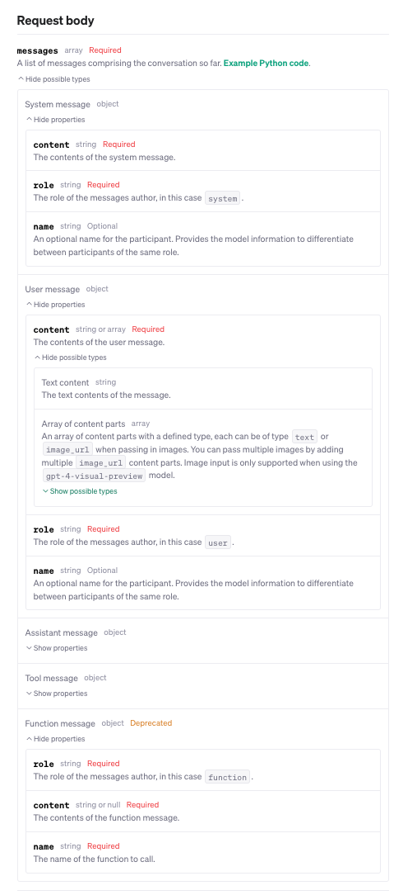

# Code Snippets

??? note "Code Snippets - Contents"
    - [Code Snippets](#code-snippets)
      - [GIT](#git)
        - [Commands](#commands)
        - [less editor](#less-editor)
        - [ghh CLI](#ghh-cli)
      - [SHELL](#shell)
        - [Shortcuts (zsh)](#shortcuts-zsh)
        - [Core Commands](#core-commands)
        - [Chaining Commands](#chaining-commands)
        - [Explanation of `grep`](#explanation-of-grep)
        - [Piping Commands](#piping-commands)
        - [Help](#help)
      - [Docker](#docker)
      - [postgres (Mac)](#postgres-mac)
        - [Table of Most Common Commands](#table-of-most-common-commands)
      - [PYTHON](#python)
        - [New OpenAI API (v 1.7.1)](#new-openai-api-v-171)
          - [API Key](#api-key)
          - [Models](#models)
          - [Chat Completions](#chat-completions)
          - [Token Counts](#token-counts)
          - [JSON Mode](#json-mode)
          - [Streaming Chat Completions](#streaming-chat-completions)
          - [Function Calling](#function-calling)
          - [Image Input Chat Completions](#image-input-chat-completions)
            - [Multiple Images](#multiple-images)
            - [Low or high fidelity image understanding](#low-or-high-fidelity-image-understanding)
          - [Error Handling](#error-handling)
          - [Rate limits](#rate-limits)
        - [numpy](#numpy)
          - [Reshaping](#reshaping)
          - [Broadcasting](#broadcasting)
      - [iTerm2](#iterm2)
        - [Tabs and Windows](#tabs-and-windows)
        - [My Favorite Shell Key Combos](#my-favorite-shell-key-combos)
        - [Moving Faster](#moving-faster)
        - [About keyboard shortcuts 💡](#about-keyboard-shortcuts-)
        - [Copy and Paste with iTerm without using the mouse](#copy-and-paste-with-iterm-without-using-the-mouse)
        - [Search the Command History](#search-the-command-history)
        - [Misc](#misc)
      - [tmux](#tmux)
        - [Pane Management](#pane-management)
        - [Window Management](#window-management)
        - [Session Management](#session-management)
        - [Resizing Panes](#resizing-panes)
        - [Miscellaneous](#miscellaneous)

---

## GIT

### Commands

| Command | Description |
| :------ | :----------- |
| `git remote add origin git@github.com:USERNAME/REPO_NAME.git` | Add remote origin (when not set) |
| `git remote set-url origin git@github.com:USERNAME/REPO_NAME.git` | Set remote origin (overwrite existing) |
| `git rm --cached FILE_OR_DIR_NAME`<br>`git commit -m "Removed FILE_OR_DIR_NAME from repository"`<br>`git push origin master` | Remove local already-pushed file from remote. |
| `git config --get remote.origin.url` | Get git remote origin's URL. |
| `git diff --cached origin/main` | Compare committed (pre-push) local changes to remote (all contents).<br>This opens the `less` editor.<br>`n`: Next change<br>`N`: Previous change<br>`spacebar`: Pagedown<br>`b`: Pageup<br>`q`: Quit<br>`?`: Help |
| `git diff --cached origin/main --name-only` | Compare committed (pre-push) local changes to remote (filenames only). |
| `git reset --hard --force` | Force-update local repo state to match remote branch (**overwrites** -- stash). |
| `git reset --soft HEAD~1` | Undo most recent _local_ commit (to staging). |
| `git reset --mixed HEAD~1` | Undo most recent _local_ commit (to unstaged). |
| `git rm file_to_delete`<br>`git commit -m "removed file_to_delete"`<br>`git push origin master` | Delete file from remote and local. |
| `git rm -r folder_to_delete`<br>`git commit -m "removed folder_to_delete"`<br>`git push origin master` | Delete folder from remote and local. |
| `git rm --cached file_to_delete`<br>`git commit -m "removed file_to_delete"`<br>`git push origin master` | Delete file from remote only. |
| `git fetch origin`<br>`git ls-tree -r master --name-only` | List all files on remote master. |
| `git commit -am "commit message"` | Add and commit all changes. |
| `git clean -f` | Force-remove untracked files. |
| `git clean -fd` | Force-remove untracked directories. |
| `cd subdirectory`<br>`sudo rm -rf .git` | Force-remove subdirectory's sub-git repo. |
| `git branch new-branch`<br>`git checkout new-branch`<br>[make changes]<br>`git add -A`<br>`git commit -m "commit message"`<br>`git push origin new-branch`<br>`git branch -d new-branch` | Create new branch, make changes, push, and delete branch locally. |
| `git log irigin/<branch-name>..HEAD` | View local commits not yet pushed to remote. |

### less editor

| Shortcut | Action |
| :------ | :----------- |
| `Space`  or  `f` | Scroll forward one window (or screen) |
| `b` | Scroll backward one window (or screen) |
| `d` | Scroll forward half a window |
| `u` | Scroll backward half a window |
| `Enter`  or  `e` | Scroll forward one line |
| `y`  or  `k` | Scroll backward one line |
| `g` | Go to the start of the document |
| `G` | Go to the end of the document |
| `/` | Search forward for a pattern |
| `?` | Search backward for a pattern |
| `n` | Repeat the previous search (in the same direction) |
| `N` | Repeat the previous search (in the opposite direction) |
| `q` | Quit  less  and return to the command line |

### ghh CLI

| Command | Description |
| :------ | :----------- |
| `gh repo create ___ --private` | Create new repo (private). |
| `gh repo clone ___` | Clone repo. |
| `gh repo view --web` | Open repo in browser. |
| `gh repo delete ___` | Delete repo. |
| `gh repo list` | List all repos. |
| `gh repo rename old-name new-name` | Rename repo. |
| `gh repo transfer ___ new-owner` | Transfer repo to new owner. |
| `gh repo fork ___` | Fork repo. |
| `gh repo fork --clone ___` | Fork repo and clone locally. |
| `gh repo fork --clone ___ --remote` | Fork repo and clone locally with remote origin. |
| `gh repo fork --clone ___ --remote --remote-name=upstream` | Fork repo and clone locally with remote origin and upstream. |

---

## SHELL

### Shortcuts (zsh)
| Key/Command | Description |
| --- | --- |
| `Ctrl + a` | Go to the beginning of the line you are currently typing on. This also works for most text input fields system wide. |
| `Ctrl + e` | Go to the end of the line you are currently typing on. This also works for most text input fields system wide. |
| `Ctrl + w` | Go to the beginning of the line you are currently typing on. This also works for most text input fields system wide. |
| `Ctrl + l` | Clears the Screen |
| `Cmd + K` | Clears the Screen |
| `Ctrl + U` | Cut everything backwards to beginning of line |
| `Ctrl + K` | Cut everything forward to end of line |
| `Ctrl + W` | Cut one word backwards using white space as delimiter |
| `Ctrl + Y` | Paste whatever was cut by the last cut command |
| `Ctrl + H` | Same as backspace |
| `Ctrl + C` | Kill whatever you are running. Also clears everything on current line |
| `Ctrl + D` | Exit the current shell when no process is running, or send EOF to a the running process |
| `Ctrl + Z` | Puts whatever you are running into a suspended background process. fg restores it |
| `Ctrl + T` | Swap the last two characters before the cursor |
| `Ctrl + _` | Undo the last command. |
| `Ctrl + F` | Move cursor one character forward |
| `Ctrl + B` | Move cursor one character backward |
| `Option + →` | Move cursor one word forward |
| `Option + ←` | Move cursor one word backward |
| `Esc + T` | Move cursor one word backward |
| `Esc + Backspace` | Swap the last two words before the cursor |
| `Tab` | Cut one word backwards using none alphabetic characters as delimiters |

### Core Commands

| Command | Description |
| --- | --- |
| `cd /` | Root of drive |
| `cd -` | Previous directory |
| `ls -l` | Long listing |
| `ls -a` | Listing including hidden files |
| `ls -lh` | Long listing with human-readable file sizes |
| `ls -R` | Entire content of folder recursively |
| `find [folder] -name [search_pattern]` | Search for files/dirs, e.g., `find . -name "*.txt"` (searches recursively) |
| `find [folder] -name [search_pattern] -type d` | Search for directories only |
| `find [folder] -name [search_pattern] -type f` | Search for files only |
| `find . -maxdepth 1 -name [search_pattern]` | Search non-recursively |
| `grep [search_pattern] [dir]` | Search all files in the specified directory for all lines that contain the pattern |
| `grep [search_pattern] [file]` | Search file for all lines that contain the pattern, e.g., `grep "Tom" file.txt` |
| `grep -r [search_pattern] [dir]` | Recursively search in all files in the specified directory for all lines that contain the pattern |
| `sudo [command]` | Run command with the security privileges of the superuser (Super User DO) |
| `open [file]` | Opens a file (as if you double-clicked it) |
| `top` | Displays active processes. Press q to quit |
| `nano [file]` | Opens the file using the nano editor |
| `vim [file]` | Opens the file using the vim editor |
| `clear` | Clears the screen |
| `reset` | Resets the terminal display |
| `unzip path/to/your/file.zip` | General unzip |
| `unzip path/to/your/file.zip -d path/to/destination/folder` | Unzip to specific path |
| `zip -r compressed_filename.zip foldername` | General zip |

### Chaining Commands
| Command | Description |
| --- | --- |
| [command-a]; [command-b] | Run command A and then B, regardless of the success of A |
| [command-a] && [command-b] | Run command B if A succeeded |
| [command-a] \|\| [command-b] | Run command B if A failed |
| [command-a] & | Run command A in the background |

### Explanation of `grep` 
* `grep` is a command-line utility for searching plain-text data sets for lines that match a regular expression.
* `grep` searches the named input FILEs (or standard input if no files are named, or the file name - is given) for lines containing a match to the given PATTERN.
* By default, `grep` prints the matching lines.
* `egrep` or `grep -E` is the same as `grep`, but uses extended regular expressions instead of basic regular expressions.
  * Example: `egrep 'foo|bar'` is the same as `grep -E 'foo|bar'`
* `fgrep` or `grep -F` is the same as `grep`, but interprets PATTERN as a list of fixed strings (instead of regular expressions), separated by newlines, any of which is to be matched.
  * This is different from normal `grep` which interprets PATTERN as a regular expression.
  * Example: `fgrep 'foo'` is the same as `grep -F 'foo'`
  * Example: `fgrep -f file1 file2` is the same as `grep -F -f file1 file2`
* To obtain the opposite effect of `grep`, use the `-v` or `--invert-match` option.
  * Example: `grep -v 'foo'` will match all lines that do not contain the string 'foo'
* Output grep results to a file using the `>` operator.
  * Example: `grep 'foo' file.txt > output.txt`

### Piping Commands
| Command | Description |
| --- | --- |
| find [dir] -name [search_pattern] | Search for files, e.g., `find /Users -name "file.txt"` (searches recursively) |
| grep [search_pattern] [file] | Search for all lines that contain the pattern, e.g., grep "Tom" file.txt |
| grep -r [search_pattern] [dir] | Recursively search in all files in the specified directory for all lines that contain the pattern |
| grep -v [search_pattern] [file] | Search for all lines that do NOT contain the pattern |
| grep -i [search_pattern] [file] | Search for all lines that contain the case-insensitive pattern |
| mdfind [search_pattern] | Spotlight search for files (names, content, other metadata), e.g., mdfind skateboard |
| mdfind -onlyin [dir] -name [pattern] | Spotlight search for files named like pattern in the given directory |

### Help
| Command | Description |
| --- | --- |
| [command] -h | Offers help |
| [command] -help | Offers help |
| info [command] | Offers help |
| man [command] | Show the help manual for [command] |
| whatis [command] | Gives a one-line description of [command] |
| apropos [search-pattern] | Searches for command with keywords in description |

---

## Docker

- Docker Image: a read-only template with instructions for creating a Docker container
- Docker Container: a runnable instance of a Docker image
- Dockerfile: a text file that contains all the commands a user could call on the command line to assemble an image.
  - `FROM`: the base image to build upon
  - `WORKDIR`: set the working directory
  - `RUN`: execute a command in the container
  - `COPY`: copy files from the host to the container
  - `ADD`: copy files from the host to the container (can also download files from the internet and copy them to the container)
  - `ARG`: set build-time variables
  - `ENV`: set environment variables
  - `EXPOSE`: expose a port
  - `CMD`: the command to run when the container starts
  - `ENTRYPOINT`: the command to run when the container starts (can be overridden by `CMD`)
  - `HEALTHCHECK`: check the health of the container
- Common Docker commands:
  - `docker build -t [image-name] .`: build the Docker image (`-t` is the tag name)
    - Use with `--file` to specify a Dockerfile other than the default `Dockerfile`
    - Use with `--build-arg [arg-name]=[arg-value]` to pass build-time variables
    - Use with `--platform` to specify the platform (e.g., `linux/amd64`, `linux/arm64`, `linux/arm/v7`)
  - `docker run -it [image-name]`: run the Docker container
  - `docker tag [image-name] [username]/[repo-name]:[tag]`: tag the Docker image
  - `docker push [username]/[repo-name]:[tag]`: push the Docker image to Docker Hub (or ECR, etc.)
  - `docker login --username [username] --password [password]`: log in to Docker Hub (or ECR, etc.)
- Docker Compose: a tool for defining and running multi-container Docker applications
  - `docker-compose up`: start the Docker containers
  - `docker-compose down`: stop the Docker containers
  - `docker-compose build`: build the Docker containers
  - `docker-compose push`: push the Docker containers to Docker Hub (or ECR, etc.)
  - `docker-compose pull`: pull the Docker containers from Docker Hub (or ECR, etc.)
  - `docker-compose config`: validate and view the Docker Compose file
  - `docker-compose logs`: view the logs of the Docker containers
  - `docker-compose ps`: view the status of the Docker containers
  - `docker-compose top`: view the processes running in the Docker containers
  - `docker-compose exec [service-name] [command]`: execute a command in a running container
  - `docker-compose run [service-name] [command]`: run a one-off command in a new container
  - `docker-compose restart [service-name]`: restart a container
  - `docker-compose stop [service-name]`: stop a container
  - `docker-compose rm [service-name]`: remove a container
  - `docker-compose kill [service-name]`: kill a container
  - `docker-compose down --rmi all`: remove all containers and images
  - `docker-compose down --volumes`: remove all volumes
  - `docker-compose down --remove-orphans`: remove all orphaned containers
- docker-compose.yaml: a YAML file that defines the Docker Compose configuration
  - `version`: the version of the Docker Compose file format
  - `services`: the services to run
  - `networks`: the networks to create
  - `volumes`: the volumes to create
  - `configs`: the configs to create
  - `secrets`: the secrets to create
  - `deploy`: the deployment configuration
  - `build`: the build configuration
  - `image`: the image configuration
  - `container_name`: the container name
  - `command`: the command to run
  - `entrypoint`: the entrypoint to run
  - `environment`: the environment variables to set
  - `env_file`: the environment variables to set from a file
  - `ports`: the ports to expose
  - `volumes`: the volumes to mount
  - `depends_on`: the services to depend on
  - `networks`: the networks to connect to
  - `network_mode`: the network mode to use
  - `restart`: the restart policy
  - `logging`: the logging configuration
  - `labels`: the labels to set
  - `configs`: the configs to mount
  - `secrets`: the secrets to mount
  - `deploy`: the deployment configuration
  - `build`: the build configuration
  - `image`: the image configuration
  - `container_name`: the container name
  - `command`: the command to run
  - `entrypoint`: the entrypoint to run
  - `environment`: the environment variables to set
  - `env_file`: the environment variables to set from a file
  - `ports`: the ports to expose
  - `volumes`: the volumes to mount
  - `depends_on`: the services to depend on
  - `networks`: the networks to connect to
  - `network_mode`: the network mode to use
  - `restart`: the restart policy
  - `logging`: the logging configuration
  - `labels`: the labels to set
  - `configs`: the configs to mount
  - `secrets`: the secrets to mount
  - `deploy`: the deployment configuration
  - `build`: the build configuration
  - `image`: the image configuration
  - `container_name`: the container name
- Makefile: a text file that contains a set of tasks to be executed by the `make` command
  - Used to automate the build process
  - Used in conjunction with Docker Compose to automate the deployment process
  - `deploy`: deploy the Docker containers using the following commands...
- End-to-End workflow using Dockerfile, docker-compose.yaml, and Makefile:
  1) In Dockerfile, specify the base image to build upon, the working directory, and the commands to run in order to build the image in the container
  2) In docker-compose.yaml, specify version, services (and their configs/ports/etc.)
  3) In Makefile, specify the commands to run to build and deploy the Docker containers
  4) Run `make deploy` to build and deploy the Docker containers
- Dockerfile example:
  ```dockerfile
  FROM python:3.8.5-slim-buster

  WORKDIR /app

  RUN apt-get update && apt-get install -y \
      build-essential \
      libpq-dev \
      libssl-dev \
      libffi-dev \
      python3-dev \
      python3-pip \
      python3-setuptools \
      python3-wheel \
      && rm -rf /var/lib/apt/lists/*

  COPY requirements.txt requirements.txt
  RUN pip3 install -r requirements.txt

  COPY . .

  CMD ["python3", "app.py"]
  ```
- Simple docker-compose.yaml example:
  ```yaml
  version: "3.8"

  services:
    app:
      build: .
      ports:
        - "5000:5000"
    db:
      image: postgres:13.3
      environment:
        POSTGRES_USER: postgres
        POSTGRES_PASSWORD: postgres
        POSTGRES_DB: postgres
      ports:
        - "5432:5432"
  ```
- Makefile example:
  ```makefile
  .PHONY: deploy
  deploy:
      docker-compose build
      docker-compose push
      docker-compose pull
      docker-compose up -d
  ```

---

## postgres (Mac)

### Table of Most Common Commands

| Action | Command |
| --- | --- |
| Start postgres and log into main local database | `psql -U [username] -d [database]` |
| List all tables in this db | `\dt` |
| List all tables in all dbs | `\dt *.*` |
| List all databases | `\l` |
| Navigate to a different database | `\c [database]` |
| List all schemas in this db | `\dn` |
| Create a new database | `CREATE DATABASE [database];` |
| Create a new schema | `CREATE SCHEMA [schema];` |
| Create a new table | `CREATE TABLE [table] ( [column] [datatype] [constraints] );` |
| Delete a database | `DROP DATABASE [database];` |
| Export a database | `pg_dump -U [username] [database] > [filename].sql` |
| Import a database | `psql -U [username] -d [database] -f [filename].sql` |
| Exit psql | `\q` |

---

## PYTHON

### New OpenAI API (v 1.7.1)

#### API Key

`export OPENAI_API_KEY='...'`

OR

save .env file in root directory with: `OPENAI_API_KEY=abc123` (be sure to add .env to .gitignore)


#### Models

| Model | Description | Context window | Training data |
| --- | --- | --- | --- |
| gpt-4-1106-preview | **GPT-4 Turbo** The latest GPT-4 model with improved instruction following, JSON mode, reproducible outputs, parallel function calling, and more. Returns a maximum of 4,096 output tokens. This preview model is not yet suited for production traffic. [Learn more](https://openai.com/blog/new-models-and-developer-products-announced-at-devday). | 128,000 tokens | Up to Apr 2023 |
| gpt-4-vision-preview | **GPT-4 Turbo with vision** Ability to understand images, in addition to all other GPT-4 Turbo capabilties. Returns a maximum of 4,096 output tokens. This is a preview model version and not suited yet for production traffic. [Dev Day](https://openai.com/blog/new-models-and-developer-products-announced-at-devday). | 128,000 tokens | Up to Apr 2023 |
| gpt-4 | Currently points to `gpt-4-0613`. See [continuous model upgrades](https://platform.openai.com/docs/models/continuous-model-upgrades). | 8,192 tokens | Up to Sep 2021 |
| gpt-4-32k | Currently points to `gpt-4-32k-0613`. See [continuous model upgrades](https://platform.openai.com/docs/models/continuous-model-upgrades). | 32,768 tokens | Up to Sep 2021 |
| gpt-4-0613 | Snapshot of `gpt-4` from June 13th 2023 with improved function calling support. | 8,192 tokens | Up to Sep 2021 |
| gpt-4-32k-0613 | Snapshot of `gpt-4-32k` from June 13th 2023 with improved function calling support. | 32,768 tokens | Up to Sep 2021 |

#### Chat Completions

**THIS IS DEPRECATED**:

```python
import openai
openai.api_key = os.getenv("OPENAI_API_KEY")

MODEL = "gpt-4" # more expensive now
response = openai.ChatCompletion.create(
  ...
)

# ChatCompletion response object:
# {
#   "id": "chatcmpl-7UkgnSDzlevZxiy0YjZcLYdUMz5yZ",
#   "object": "chat.completion",
#   "created": 1687563669,
#   "model": "gpt-4",
#   "choices": [
#     {
#       "index": 0,
#       "message": {
#         "role": "assistant",
#         "content": "\n\nHello there, how may I assist you today?",
#       },
#       "finish_reason": "stop"
#     }
#   ],
#   "usage": {
#     "prompt_tokens": 39,
#     "completion_tokens": 3,
#     "total_tokens": 42
#   }
# }
```

**THIS IS THE NEW WAY**:

```python
from openai import OpenAI
client = OpenAI() # defaults to looking for OPENAI_API_KEY or .env file

MODEL = "gpt-4-turbo" # cheaper & smarter
completion = client.chat.completions.create(
    model=MODEL,
    messages=[
        {"role": "system", "content": "You are a helpful assistant."},

        {"role": "user", "content": "Knock knock."},
        {"role": "assistant", "content": "Who's there?"},
        
        {"role": "user", "content": "Orange."},
    ],
    temperature=0,
)

# Chat completion object:
# {
#   "id": "chatcmpl-123",
#   "object": "chat.completion",
#   "created": 1677652288,
#   "model": "gpt-4-turbo",
#   "system_fingerprint": "fp_44709d6fcb",
#   "choices": [{
#     "index": 0,
#     "message": {
#       "role": "assistant",
#       "content": "Orange who?"
#     },
#     "logprobs": null,
#     "finish_reason": "stop"
#   }],
#   "usage": {
#     "prompt_tokens": 9,
#     "completion_tokens": 12,
#     "total_tokens": 21
#   }
# }

print(completion.choices[0].message.content)
# 'Orange who?'
```

**Chat Completions Request body fields:**




Response object fields:

- `id`: the ID of the request
- `object`: the type of object returned (e.g., `chat.completion`)
- `created`: the timestamp of the request
- `model`: the full name of the model used to generate the response
- `usage`: the number of tokens used to generate the replies, counting prompt, completion, and total
- `choices`: a list of completion objects (only one, unless you set `n` greater than 1)
    - `message`: the message object generated by the model, with `role` and `content`
    - `finish_reason`: the reason the model stopped generating text (either `stop`, or `length` if `max_tokens` limit was reached)
    - `index`: the index of the completion in the list of choices

```python
# Example with system prompt & few-shot learning:

# Faked few-shot conversation to prime the model into translating business jargon into simpler speech
# (OPTIONAL: Use the `name` parameter in the example messages -- so the model won't refer back to them & can differentiate between participants of the same role
completion = client.chat.completions.create(
    model=MODEL,
    messages=[
        {"role": "system", "content": "You are a helpful, pattern-following assistant that translates corporate jargon into plain English."},
        
        {"role": "system", "name":"example_user", "content": "New synergies will help drive top-line growth."},
        {"role": "system", "name": "example_assistant", "content": "Things working well together will increase revenue."},
        
        {"role": "system", "name":"example_user", "content": "Let's circle back when we have more bandwidth to touch base on opportunities for increased leverage."},
        {"role": "system", "name": "example_assistant", "content": "Let's talk later when we're less busy about how to do better."},
        
        {"role": "user", "content": "This late pivot means we don't have time to boil the ocean for the client deliverable."},
    ],
    temperature=0,
)

print(response["choices"][0]["message"]["content"])
# This sudden change in plans means we don't have enough time to do everything for the client's project.
```

#### Token Counts

* Context window equivalents:
  * 1 token --> 4 characters
  * 128,000 tokens --> 512,000 characters
  * Natural Language:
    * 6 characters per English word on average (5 char + 1 space)
    * 512,000 characters / 6 characters per word ≈ 85,333 words
    * 85,333 words / 250 words per page using 12pt Times New Roman ≈ 341 double-spaced pages (170 single-spaced pages)
    * **So 128,000 tokens is roughly equivalent to 170 single-spaced pages of text**
  * Code:
    * 50 characters per line on average
    * 512,000 characters / 50 characters per line ≈ 10,240 lines of code
    * **So 128,000 tokens is roughly equivalent to 10,240 lines of code**

Function to track tokens:

```python
def num_tokens_from_messages(messages, model="gpt-3.5-turbo-0613"):
  """Returns the number of tokens used by a list of messages."""
  try:
      encoding = tiktoken.encoding_for_model(model)
  except KeyError:
      encoding = tiktoken.get_encoding("cl100k_base")
  if model == "gpt-3.5-turbo-0613":  # note: future models may deviate from this
      num_tokens = 0
      for message in messages:
          num_tokens += 4  # every message follows <im_start>{role/name}\n{content}<im_end>\n
          for key, value in message.items():
              num_tokens += len(encoding.encode(value))
              if key == "name":  # if there's a name, the role is omitted
                  num_tokens += -1  # role is always required and always 1 token
      num_tokens += 2  # every reply is primed with <im_start>assistant
      return num_tokens
  else:
      raise NotImplementedError(f"""num_tokens_from_messages() is not presently implemented for model {model}.
      See https://github.com/openai/openai-python/blob/main/chatml.md for information on how messages are converted to tokens.""")
```

#### JSON Mode

A common way to use Chat Completions is to instruct the model to always return a JSON object that makes sense for your use case, by specifying this in the system message. While this does work in some cases, occasionally the models may generate output that does not parse to valid JSON objects.

To prevent these errors and improve model performance, when calling `gpt-4-1106-preview` or `gpt-3.5-turbo-1106`, you can set [response\_format](https://platform.openai.com/docs/api-reference/chat/create#chat-create-response_format) to `{ "type": "json_object" }` to enable JSON mode. When JSON mode is enabled, the model is constrained to only generate strings that parse into valid JSON object.

Important notes:

- When using JSON mode, **always** instruct the model to produce JSON via some message in the conversation, for example via your system message. If you don't include an explicit instruction to generate JSON, the model may generate an unending stream of whitespace and the request may run continually until it reaches the token limit. To help ensure you don't forget, the API will throw an error if the string `"JSON"` does not appear somewhere in the context.
- The JSON in the message the model returns may be partial (i.e. cut off) if `finish_reason` is `length`, which indicates the generation exceeded `max_tokens` or the conversation exceeded the token limit. To guard against this, check `finish_reason` before parsing the response.
- JSON mode will not guarantee the output matches any specific schema, only that it is valid and parses without errors.

```python
from openai import OpenAI
client = OpenAI()

response = client.chat.completions.create(
  model="gpt-3.5-turbo-1106",
  response_format={ "type": "json_object" },
  messages=[
    {"role": "system", "content": "You are a helpful assistant designed to output JSON."},
    {"role": "user", "content": "Who won the world series in 2020?"}
  ]
)
print(response.choices[0].message.content)
```

In this example, the response includes a JSON object that looks something like the following:

`"content": "{\"winner\": \"Los Angeles Dodgers\"}"`

**Note that JSON mode is always enabled when the model is generating arguments as part of function calling.**

#### Streaming Chat Completions

```python
from openai import OpenAI
client = OpenAI()

completion = client.chat.completions.create(
  model="gpt-4-1106-preview",
  messages=[
    {"role": "system", "content": "You are a helpful assistant."},
    {"role": "user", "content": "Hello!"}
  ],
  stream=True
)

for chunk in completion:
  print(chunk.choices[0].delta)


# ..........
# {
#     "id": "chatcmpl-123",
#     "object": "chat.completion.chunk",
#     "created": 1694268190,
#     "model": "gpt-3.5-turbo-0613",
#     "system_fingerprint": "fp_44709d6fcb",
#     "choices": [
#         {
#             "index": 0,
#             "delta": {
#                 "content": " today"
#             },
#             "logprobs": null,
#             "finish_reason": null
#         }
#     ]
# }

# {
#     "id": "chatcmpl-123",
#     "object": "chat.completion.chunk",
#     "created": 1694268190,
#     "model": "gpt-3.5-turbo-0613",
#     "system_fingerprint": "fp_44709d6fcb",
#     "choices": [
#         {
#             "index": 0,
#             "delta": {
#                 "content": "?"
#             },
#             "logprobs": null,
#             "finish_reason": null
#         }
#     ]
# }

# {
#     "id": "chatcmpl-123",
#     "object": "chat.completion.chunk",
#     "created": 1694268190,
#     "model": "gpt-3.5-turbo-0613",
#     "system_fingerprint": "fp_44709d6fcb",
#     "choices": [
#         {
#             "index": 0,
#             "delta": {},
#             "logprobs": null,
#             "finish_reason": "stop" <---- stop here
#         }
#     ]
# }
```

#### Function Calling

```python
from openai import OpenAI
client = OpenAI()

tools = [
  {
    "type": "function",
    "function": {
      "name": "get_current_weather",
      "description": "Get the current weather in a given location",
      "parameters": {
        "type": "object",
        "properties": {
          "location": {
            "type": "string",
            "description": "The city and state, e.g. San Francisco, CA",
          },
          "unit": {"type": "string", "enum": ["celsius", "fahrenheit"]},
        },
        "required": ["location"],
      },
    }
  }
]
messages = [{"role": "user", "content": "What's the weather like in Boston today?"}]
completion = client.chat.completions.create(
  model="gpt-4-1106-preview",
  messages=messages,
  tools=tools,
  tool_choice="auto"
)

print(completion)

# {
#   "id": "chatcmpl-abc123",
#   "object": "chat.completion",
#   "created": 1699896916,
#   "model": "gpt-3.5-turbo-0613",
#   "choices": [
#     {
#       "index": 0,
#       "message": {
#         "role": "assistant",
#         "content": null,
#         "tool_calls": [
#           {
#             "id": "call_abc123",
#             "type": "function",
#             "function": {
#               "name": "get_current_weather",
#               "arguments": "{\n\"location\": \"Boston, MA\"\n}"
#             }
#           }
#         ]
#       },
#       "logprobs": null,
#       "finish_reason": "tool_calls"
#     }
#   ],
#   "usage": {
#     "prompt_tokens": 82,
#     "completion_tokens": 17,
#     "total_tokens": 99
#   }
# }

```

#### Image Input Chat Completions

```python
from openai import OpenAI

client = OpenAI()

response = client.chat.completions.create(
    model="gpt-4-vision-preview",
    messages=[
        {
            "role": "user",
            "content": [
                {"type": "text", "text": "What’s in this image?"},
                {
                    "type": "image_url",
                    "image_url": "https://upload.wikimedia.org/wikipedia/commons/thumb/d/dd/Gfp-wisconsin-madison-the-nature-boardwalk.jpg/2560px-Gfp-wisconsin-madison-the-nature-boardwalk.jpg",
                },
            ],
        }
    ],
    max_tokens=300,
)

print(response.choices[0])
```

##### Multiple Images


The Chat Completions API is capable of taking in and processing multiple image inputs in both base64 encoded format or as an image URL. The model will process each image and use the information from all of them to answer the question.

```python
from openai import OpenAI

client = OpenAI()
response = client.chat.completions.create(
  model="gpt-4-vision-preview",
  messages=[
    {
      "role": "user",
      "content": [
        {
          "type": "text",
          "text": "What are in these images? Is there any difference between them?",
        },
        {
          "type": "image_url",
          "image_url": {
            "url": "https://upload.wikimedia.org/wikipedia/commons/thumb/d/dd/Gfp-wisconsin-madison-the-nature-boardwalk.jpg/2560px-Gfp-wisconsin-madison-the-nature-boardwalk.jpg",
          },
        },
        {
          "type": "image_url",
          "image_url": {
            "url": "https://upload.wikimedia.org/wikipedia/commons/thumb/d/dd/Gfp-wisconsin-madison-the-nature-boardwalk.jpg/2560px-Gfp-wisconsin-madison-the-nature-boardwalk.jpg",
          },
        },
      ],
    }
  ],
  max_tokens=300,
)
print(response.choices[0])
```

Here the model is shown two copies of the same image and can answer questions about both or each of the images independently.

##### Low or high fidelity image understanding

By controlling the `detail` parameter, which has three options, `low`, `high`, or `auto`, you have control over how the model processes the image and generates its textual understanding. By default, the model will use the `auto` setting which will look at the image input size and decide if it should use the `low` or `high` setting.

- `low` will disable the “high res” model. The model will receive a low-res 512px x 512px version of the image, and represent the image with a budget of 65 tokens. This allows the API to return faster responses and consume fewer input tokens for use cases that do not require high detail.
- `high` will enable “high res” mode, which first allows the model to see the low res image and then creates detailed crops of input images as 512px squares based on the input image size. Each of the detailed crops uses twice the token budget (65 tokens) for a total of 129 tokens.
```python
from openai import OpenAI

client = OpenAI()

response = client.chat.completions.create(
  model="gpt-4-vision-preview",
  messages=[
    {
      "role": "user",
      "content": [
        {"type": "text", "text": "What’s in this image?"},
        {
          "type": "image_url",
          "image_url": {
            "url": "https://upload.wikimedia.org/wikipedia/commons/thumb/d/dd/Gfp-wisconsin-madison-the-nature-boardwalk.jpg/2560px-Gfp-wisconsin-madison-the-nature-boardwalk.jpg",
            "detail": "high"
          },
        },
      ],
    }
  ],
  max_tokens=300,
)

print(response.choices[0].message.content)
```

#### Error Handling

```python
import openai
from openai import OpenAI
client = OpenAI()

try:
  #Make your OpenAI API request here
  response = client.completions.create(
    prompt="Hello world",
    model="gpt-3.5-turbo-instruct"
  )
except openai.APIError as e:
  #Handle API error here, e.g. retry or log
  print(f"OpenAI API returned an API Error: {e}")
  pass
except openai.APIConnectionError as e:
  #Handle connection error here
  print(f"Failed to connect to OpenAI API: {e}")
  pass
except openai.RateLimitError as e:
  #Handle rate limit error (we recommend using exponential backoff)
  print(f"OpenAI API request exceeded rate limit: {e}")
  pass
```

#### Rate limits

Rate limits are restrictions that our API imposes on the number of times a user or client can access our services within a specified period of time.

[Rate Limits](img/Rate%20limits.png)

How do these rate limits work?

Rate limits are measured in five ways: **RPM** (requests per minute), **RPD** (requests per day), **TPM** (tokens per minute), **TPD** (tokens per day), and **IPM** (images per minute). Rate limits can be hit across any of the options depending on what occurs first. For example, you might send 20 requests with only 100 tokens to the ChatCompletions endpoint and that would fill your limit (if your RPM was 20), even if you did not send 150k tokens (if your TPM limit was 150k) within those 20 requests.

Other important things worth noting:

- Rate limits are imposed at the [organization level](https://platform.openai.com/docs/guides/production-best-practices), not user level.
- Rate limits vary by the [model](https://platform.openai.com/docs/models/models) being used.
- Limits are also placed on the total amount an organization can spend on the API each month. These are also known as "usage limits".


(See [here](https://platform.openai.com/docs/guides/rate-limits/error-mitigation) for more info on rate limit & error mitigation strategies.)

---

### numpy

#### Reshaping

* The reshape() function takes a single tuple argument that specifies the new shape of the array
  * Used frequently to _add_ a dimension of when for libs like sklearn and keras (to the END of the shape tuple -- i.e. **right-padding with 1s**)
* In the case of reshaping 1-D `(m,)` --> 2-D `(m,1)`:
  * Tuple would be the shape of the array as the first dimension (data.shape[0]) and 1 for the second dimension:
    * `data.shape == (m_old, )` (e.g. `(1000,)`)
    * `data = data.reshape( (m_old, n_new)  )`
      * `data.shape == (m_old, n_new)` (e.g. `(1000, 1)`)

#### Broadcasting

In formal LinAlg, arithmetic can only be performed when:  

* the shape of each dimension in the arrays are equal (even for dotproduct - though not matmul)
  
However, in ML, we often want to add **A** `(m,n)` to **v** `(,n)`.  
NumPy enables this by _broadcasting_ the vector to the shape of the matrix.  
Specifically np (**which considers vectors as (n,) since it is row-oriented**) effectively:

1. **Left-pads with 1s** the dimensions of the smaller array
2. **Right-to-left compares** the dimensions of the two arrays and ensures either
  a. The dimensions are equal **OR**
  b. At least one of the dimensions is 1
3. If all dimensions pass, np **replicates** (_broadcast_) the smaller array along the dim(s) where it is 1 to match the shape of the larger array.

**NOTE**: Broadcasting is not a copy operation. It is a view of the original array with the same data. This means that if you modify a broadcasted array, it modifies the original array.  

So for example:  

* 1-D vs. 2-D
  * LOOKS like comparing:  
    * A.shape -- (2,3)  
    * b.shape -- (3,)  
  * ACTUALLY np is comparing:  
    * A.shape -- (2,3)  
    * b.shape -- (1,3)  
* 2-D vs. scalar  
  * LOOKS like comparing:  
    * A.shape -- (2,3)  
    * b.shape -- (1,)  
  * ACTUALLY np is comparing:  
    * A.shape -- (2,3)  
    * b.shape -- (1,1)

---

## iTerm2

### Tabs and Windows


**Function** | **Shortcut**
-------- | --------
New Tab | `⌘` + `T`
Close Tab or Window | `⌘` + `W`  (same as many mac apps)
Go to Tab | `⌘` + `Number Key`  (ie: `⌘2` is 2nd tab)
Go to Split Pane by Direction | `⌘` + `Option` + `Arrow Key`
Cycle iTerm Windows | `⌘` + `backtick`  (true of all mac apps and works with desktops/mission control)
**Splitting** | 
Split Window Vertically (same profile) | `⌘` + `D`
Split Window Horizontally (same profile) | `⌘` + `Shift` + `D`  (mnemonic: shift is a wide horizontal key)
**Moving** |
Move a pane with the mouse | `⌘` + `Alt` + `Shift` and then drag the pane from anywhere
**Fullscreen** |
Fullscreen | `⌘`+ `Enter`
Maximize a pane | `⌘` + `Shift` + `Enter`  (use with fullscreen to temp fullscreen a pane!)
Resize Pane | `Ctrl` + `⌘` + `Arrow` (given you haven't mapped this to something else)
**Less Often Used By Me** |
Go to Split Pane by Order of Use | `⌘` + `]` , `⌘` + `[`
Split Window Horizontally (new profile) | `Option` + `⌘` + `H`
Split Window Vertically (new profile) | `Option` + `⌘` + `V`
Previous Tab | `⌘`+ `Left Arrow`  (I usually move by tab number like `⌘+1`)
Next Tab | `⌘`+ `Right Arrow`
Go to Window | `⌘` + `Option` + `Number`


### My Favorite Shell Key Combos

These might be helpful to getting you faster with the shell.
These are just common shell shortcuts unrelated to iTerm itelf.
These will usually work in Bash/Zsh/Fish on Mac and on Linux.
There are many shortcuts out there but I use these quite a bit.
There is also more than one way to do a thing so adopt what you like best.

Hopefully some of these improve your work life.  :)

**Function** | **Key Combination** | **Use**
-------- | -------- | --------
Delete to start of line | `Ctrl` + `U` | Use this to start over typing without hitting Ctrl-C
Delete to end of line | `Ctrl` + `K` | Use this with command history to repeat commands and changing one thing at the end!
Repeat last command | `Up Arrow` | Cycle and browse your history with up and down.  `Ctrl-R` is faster if you know the string you are looking for.
Move back and forth on a line | `Arrow Keys` | This takes you off the home row but it's easy to remember
Move back and forth on a line by words | `⌥` + `Arrow Keys` | Fast way to jump by words to correct a typo or "run again" with minor changes to last command.  Ctrl as modifier might also work on mac and non-mac keyboards/shells/apps.
Delete previous word (in shell) | `Ctrl` + `W` | It's faster to delete by words.  Especially when your last command was wrong by a single typo or something.
Clear screen | `Ctrl` + `L` | This is telling the shell to do it instead of an explicit command like `clear` or `cls` in DOS.  If you use `⌘` + `K`, this is telling iTerm to clear the screen which might have the same result or do something terrible (like when using a TUI like `top` or `htop`.  In general, use this instead of typing `clear` over and over.
Exit Shell | `Ctrl` + `D` | Instead of typing exit, just get this in muscle memory.  It works in many contexts.


### Moving Faster

A lot of shell shortcuts work in iterm and it's good to learn these because arrow keys, home/end
keys and Mac equivalents don't always work.  For example `⌘` + `Left Arrow` is usually the same as `Home`
(go to beginning of current line) but that doesn't work in the shell.  Home works in many apps but it
takes you away from the home row.

**Function** | **Shortcut**
-------- | --------
Move to the start of line | `Ctrl` + `A` or `Home` (Home is fn+Left arrow)
Move to the end of line | `Ctrl` + `E` or `End` (End is fn+Right arrow)
Moving by word on a line (this is a shell thing but passes through fine)| `Ctrl` + `Left/Right Arrow`
Cursor Jump with Mouse (shell and vim - might depend on config) | `Option` + `Left Click`

### About keyboard shortcuts 💡
> So, some keyboard shortcuts are Mac's.  For example fn+Left Arrow is the Home key.  On a fullsize Mac keyboard, there is a Home key.  Home will usually pass through to iTerm and the shell.  By shell, I mean zsh, bash or fish.  The shell is the program running inside of iTerm when you open iTerm.  If you launch `vim` or something, zsh/bash/fish is "gone" because vim is running.  So, it's complicated to explain when keys work and when they don't.
>
> For example, Home will work in zsh.  It will take you to the beginning of the line.  If your cursor is at the end of "three" in this below example
> ```
> one two three|
> ```
> When you press Home (fn+Left Arrow) your cursor will be on one: `|one`
> So, in this way, Home works the same in "the shell" as it does in TextEdit.app or any basic text box on Mac.
> This is not the case if you start up `vim` or `emacs`.  This is not iTerm's fault.  This is just how Mac/Linux works.  Just a head's up on that little detail.

### Copy and Paste with iTerm without using the mouse

I don't use this feature too much.  I instead just mouse select (which copies to the clipboard) and paste.  There's no need to Copy to the clipboard if you have `General > Selection > Copy to pasteboard on selection` enabled.

**Function** | **Shortcut**
-------- | --------
Enter Copy Mode | `Shift` + `⌘` + `C`
Enter Character Selection Mode in Copy Mode | `Ctrl` + `V`
Move cursor in Copy Mode | `HJKL` vim motions or arrow keys
Copy text in Copy Mode | `Ctrl` + `K`

Copy actions goes into the normal system clipboard which you can paste like normal.


### Search the Command History

Some of these are not directly related to iTerm and are just "shell features".  Like, if you open Terminal.app on Mac some of these still work because it's the shell and not iTerm.  I'm including them anyway.

**Function** | **Shortcut**
-------- | --------
Search as you type | `Ctrl` + `R` and type the search term; Repeat `Ctrl` + `R` to loop through result
Search the last remembered search term | `Ctrl` + `R` twice
End the search at current history entry  | `Ctrl` + `Y`
Cancel the search and restore original line | `Ctrl` + `G`

### Misc

**Function** | **Shortcut**
-------- | --------
Clear the screen/pane (when `Ctrl + L` won't work) | `⌘` + `K`  (I use this all the time)
Broadcast command to all panes in window (nice when needed!) | `⌘` + `Alt` +  `I` (again to toggle)
Find Cursor | `⌘` + `/`  _or use a theme or cursor shape that is easy to see_

## tmux

### Pane Management

* Split Pane Horizontally: `Ctrl + b, then "`
* Split Pane Vertically: `Ctrl + b, then %`
* Switch to x Pane: `Ctrl + b, then x-arrow`
* Close Current Pane: `Ctrl + b, then x (then press y to confirm)`
* (Switch to Next Pane: `Ctrl + b, then o)`

### Window Management

* Create New Window: `Ctrl + b, then c`
* Switch to Next Window: `Ctrl + b, then n`
* Switch to Previous Window: `Ctrl + b, then p`
* List Windows: `Ctrl + b, then w`
* Rename Current Window: `Ctrl + b, then ,`

### Session Management

* Detach from Session: `Ctrl + b, then d`
* List Sessions: `tmux ls (outside of tmux)`
* Attach to a Session: `tmux attach-session -t [session-name]`

### Resizing Panes

* Resize Pane Up: `Ctrl + b:resize-pane -U 10`
* Resize Pane Down: `Ctrl + b:resize-pane -D 10`
* Resize Pane Left: `Ctrl + b:resize-pane -L 10`
* Resize Pane Right: `Ctrl + b:resize-pane -R 10`

### Miscellaneous

* Scroll Mode: `Ctrl + b, then [ (use arrow keys to scroll, q to exit scroll mode)`
* Copy Mode: `Ctrl + b, then [ (enter copy mode for text selection)`
* Paste from Buffer: `Ctrl + b, then ]`

---
