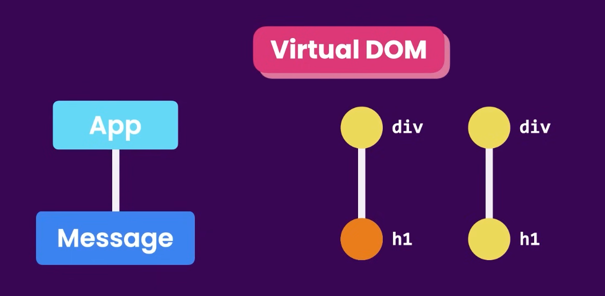

# Web Development Notes

??? note "Web Development - Contents"
	- [Web Development Notes](webdev_snippets.md#web-development-notes)
	- [HTML](webdev_snippets.md#html)
		- [Tags vs Attributes](webdev_snippets.md#tags-vs-attributes)
		- [Tags](webdev_snippets.md#tags)
	- [CSS](webdev_snippets.md#css)
		- [Properties and Usage](webdev_snippets.md#properties-and-usage)
	- [Example Webpage](webdev_snippets.md#example-webpage)
	- [JavaScript](webdev_snippets.md#javascript)
		- [JavaScript Basics](webdev_snippets.md#javascript-basics)
			- [How to run JavaScript code](webdev_snippets.md#how-to-run-javascript-code)
				- [In the browser](webdev_snippets.md#in-the-browser)
				- [In the terminal](webdev_snippets.md#in-the-terminal)
				- [In VS Code](webdev_snippets.md#in-vs-code)
			- [Printing, Variables, Arrays, Functions](webdev_snippets.md#printing-variables-arrays-functions)
				- [Printing to the Console](webdev_snippets.md#printing-to-the-console)
				- [Variable Declaration and Assignment](webdev_snippets.md#variable-declaration-and-assignment)
				- [Array Declaration and Manipulation](webdev_snippets.md#array-declaration-and-manipulation)
				- [Function Declaration and Calling](webdev_snippets.md#function-declaration-and-calling)
			- [If-Statement syntax  in JavaScript](webdev_snippets.md#if-statement-syntax--in-javascript)
				- [Syntax](webdev_snippets.md#syntax)
				- [If-else syntax:](webdev_snippets.md#if-else-syntax)
				- [If-else-if syntax:](webdev_snippets.md#if-else-if-syntax)
				- [Boolean Values in JavaScript](webdev_snippets.md#boolean-values-in-javascript)
				- [Comparison Operators in JavaScript](webdev_snippets.md#comparison-operators-in-javascript)
				- [Ternary Operator](webdev_snippets.md#ternary-operator)
				- [Switch Statements](webdev_snippets.md#switch-statements)
				- [Return Early Pattern for Functions](webdev_snippets.md#return-early-pattern-for-functions)
			- [JavaScript Objects](webdev_snippets.md#javascript-objects)
				- [Updating Object Properties](webdev_snippets.md#updating-object-properties)
				- [Add New Properties to a JavaScript Object](webdev_snippets.md#add-new-properties-to-a-javascript-object)
				- [Delete Properties from a JavaScript Object](webdev_snippets.md#delete-properties-from-a-javascript-object)
				- [Using Objects for Lookups](webdev_snippets.md#using-objects-for-lookups)
				- [Testing Objects for Properties](webdev_snippets.md#testing-objects-for-properties)
				- [Nested Objects](webdev_snippets.md#nested-objects)
				- [Accessing Nested Arrays](webdev_snippets.md#accessing-nested-arrays)
			- [Looping](webdev_snippets.md#looping)
				- [While Loops](webdev_snippets.md#while-loops)
				- [For Loops](webdev_snippets.md#for-loops)
				- [Iterate Through an Array with a For Loop](webdev_snippets.md#iterate-through-an-array-with-a-for-loop)
				- [Nesting For Loops](webdev_snippets.md#nesting-for-loops)
				- [Do...While Loops](webdev_snippets.md#dowhile-loops)
				- [Profile Lookup](webdev_snippets.md#profile-lookup)
			- [Constructor Functions](webdev_snippets.md#constructor-functions)
				- [Purpose](webdev_snippets.md#purpose)
				- [Syntax](webdev_snippets.md#syntax-1)
				- [Invoking a Constructor Function](webdev_snippets.md#invoking-a-constructor-function)
				- [Extending Constructors to Receive Arguments](webdev_snippets.md#extending-constructors-to-receive-arguments)
				- [Verify an Object's Constructor with instanceof](webdev_snippets.md#verify-an-objects-constructor-with-instanceof)
				- [Understand Own Properties](webdev_snippets.md#understand-own-properties)
				- [Use Prototype Properties to Reduce Duplicate Code](webdev_snippets.md#use-prototype-properties-to-reduce-duplicate-code)
				- [Iterate Over All Properties](webdev_snippets.md#iterate-over-all-properties)
			- [Methods](webdev_snippets.md#methods)
				- [Methods](webdev_snippets.md#methods-1)
				- [Example](webdev_snippets.md#example)
			- [Built-In Functions: Random Numbers \& Int-to-String Conversion](webdev_snippets.md#built-in-functions-random-numbers--int-to-string-conversion)
				- [Generate Random Fractions with JavaScript](webdev_snippets.md#generate-random-fractions-with-javascript)
				- [Generate Random Whole Numbers with JavaScript](webdev_snippets.md#generate-random-whole-numbers-with-javascript)
				- [Generate Random Whole Numbers within a Range](webdev_snippets.md#generate-random-whole-numbers-within-a-range)
				- [Use the parseInt Function](webdev_snippets.md#use-the-parseint-function)
				- [Use the parseInt Function with a Radix](webdev_snippets.md#use-the-parseint-function-with-a-radix)
			- [Recursion](webdev_snippets.md#recursion)
				- [Using recursion to create a countdown](webdev_snippets.md#using-recursion-to-create-a-countdown)
				- [Using recursion to create a range of numbers](webdev_snippets.md#using-recursion-to-create-a-range-of-numbers)
			- [Useful JavaScript Built-in Functions](webdev_snippets.md#useful-javascript-built-in-functions)
		- [ES6](webdev_snippets.md#es6)
			- [Use Arrow Functions to Write Concise Anonymous Functions](webdev_snippets.md#use-arrow-functions-to-write-concise-anonymous-functions)
			- [Write Arrow Functions with Parameters](webdev_snippets.md#write-arrow-functions-with-parameters)
			- [Set Default Parameters for Your Functions](webdev_snippets.md#set-default-parameters-for-your-functions)
			- [Compare Scopes of the var and let Keywords](webdev_snippets.md#compare-scopes-of-the-var-and-let-keywords)
			- [Mutate an Array Declared with const](webdev_snippets.md#mutate-an-array-declared-with-const)
			- [Prevent Object Mutation](webdev_snippets.md#prevent-object-mutation)
			- [Use the Rest Parameter with Function Parameters](webdev_snippets.md#use-the-rest-parameter-with-function-parameters)
			- [Use the Spread Operator to Evaluate Arrays In-Place](webdev_snippets.md#use-the-spread-operator-to-evaluate-arrays-in-place)
			- [Use Destructuring Assignment to Extract Values from Objects](webdev_snippets.md#use-destructuring-assignment-to-extract-values-from-objects)
			- [Use Destructuring Assignment to Assign Variables from Objects](webdev_snippets.md#use-destructuring-assignment-to-assign-variables-from-objects)
			- [Use Destructuring Assignment to Assign Variables from Arrays](webdev_snippets.md#use-destructuring-assignment-to-assign-variables-from-arrays)
			- [Destructuring via rest elements](webdev_snippets.md#destructuring-via-rest-elements)
			- [Use Destructuring Assignment to Pass an Object as a Function's Parameters](webdev_snippets.md#use-destructuring-assignment-to-pass-an-object-as-a-functions-parameters)
			- [Create Strings using Template Literals](webdev_snippets.md#create-strings-using-template-literals)
			- [Write Concise Object Literal Declarations Using Object Property Shorthand](webdev_snippets.md#write-concise-object-literal-declarations-using-object-property-shorthand)
			- [Write Concise Declarative Functions with ES6](webdev_snippets.md#write-concise-declarative-functions-with-es6)
			- [Use class Syntax to Define a Constructor Function](webdev_snippets.md#use-class-syntax-to-define-a-constructor-function)
			- [Use getters and setters to Control Access to an Object](webdev_snippets.md#use-getters-and-setters-to-control-access-to-an-object)
			- [Create a Module Script](webdev_snippets.md#create-a-module-script)
			- [Use export to Share a Code Block](webdev_snippets.md#use-export-to-share-a-code-block)
	- [The DOM](webdev_snippets.md#the-dom)
    	- [Theory of the DOM](webdev_snippets.md#theory-of-the-dom)
    	- [Tree Details](webdev_snippets.md#tree-details)
    	- [Common Usage Patterns (JavaScript Interaction)](webdev_snippets.md#common-usage-patterns-javascript-interaction)
	- [jQuery](webdev_snippets.md#jquery)
		- [Raison Detre](webdev_snippets.md#raison-detre)
		- [Common Usage Patterns](webdev_snippets.md#common-usage-patterns)
	- [Async Programming in JavaScript](webdev_snippets.md#async-programming-in-javascript)
		- [Theory of Async Programming](webdev_snippets.md#theory-of-async-programming)
		- [Promises](webdev_snippets.md#promises)
		- [Understanding Promises](webdev_snippets.md#understanding-promises)
		- [Syntax and Usage](webdev_snippets.md#syntax-and-usage)
		- [Promise States](webdev_snippets.md#promise-states)
		- [Promise Methods](webdev_snippets.md#promise-methods)
		- [Promise.all()](webdev_snippets.md#promiseall)
		- [Chaining Promises](webdev_snippets.md#chaining-promises)
		- [Async/Await](webdev_snippets.md#asyncawait)
		- [Async Function](webdev_snippets.md#async-function)
		- [Await Keyword](webdev_snippets.md#await-keyword)
		- [Common Usage Patterns](webdev_snippets.md#common-usage-patterns-1)
		- [Callbacks](webdev_snippets.md#callbacks)
		- [Understanding Callbacks](webdev_snippets.md#understanding-callbacks)
		- [Syntax and Basic Usage](webdev_snippets.md#syntax-and-basic-usage)
		- [Callback Hell and Its Avoidance](webdev_snippets.md#callback-hell-and-its-avoidance)
		- [Event Loop](webdev_snippets.md#event-loop)
		- [Understanding the Event Loop](webdev_snippets.md#understanding-the-event-loop)
		- [Event Loop Phases](webdev_snippets.md#event-loop-phases)
		- [Event Loop Example](webdev_snippets.md#event-loop-example)
		- [Event Loop and Asynchronous Operations](webdev_snippets.md#event-loop-and-asynchronous-operations)
	- [Table of common built-in network request functions](webdev_snippets.md#table-of-common-built-in-network-request-functions)
	- [Introduction to React Framework](webdev_snippets.md#introduction-to-react-framework)
		- [Background and Theory](webdev_snippets.md#background-and-theory)
		- [Why React?](webdev_snippets.md#why-react)
		- [Basic Concepts](webdev_snippets.md#basic-concepts)
		- [Common Usage](webdev_snippets.md#common-usage)
		- [Intermediate Concepts](webdev_snippets.md#intermediate-concepts)
		- [React Common Libraries](webdev_snippets.md#react-common-libraries)
	- [Primer on TypeScript](webdev_snippets.md#primer-on-typescript)
		- [Examples of TypeScript](webdev_snippets.md#examples-of-typescript)
		- [TypeScript vs JavaScript](webdev_snippets.md#typescript-vs-javascript)
		- [TypeScript with React](webdev_snippets.md#typescript-with-react)
	- [Node.js and npm](webdev_snippets.md#nodejs-and-npm)
		- [Background and Theory of Node.js](webdev_snippets.md#background-and-theory-of-nodejs)
		- [Why Use Node.js?](webdev_snippets.md#why-use-nodejs)
		- [npm: Node Package Manager](webdev_snippets.md#npm-node-package-manager)
		- [Common npm Commands](webdev_snippets.md#common-npm-commands)
		- [package.json File](webdev_snippets.md#packagejson-file)
  			- [Example package.json](webdev_snippets.md#example-packagejson)
	- [Introduction to Yarn](webdev_snippets.md#introduction-to-yarn)
		- [Why Use Yarn?](webdev_snippets.md#why-use-yarn)
		- [Common Yarn Commands](webdev_snippets.md#common-yarn-commands)
		- [yarn.lock File](webdev_snippets.md#yarnlock-file)
		- [Example usage in a project](webdev_snippets.md#example-usage-in-a-project)
	- [Redux](webdev_snippets.md#redux)
		- [Key Concepts of Redux:](webdev_snippets.md#key-concepts-of-redux)
		- [Why Use Redux?](webdev_snippets.md#why-use-redux)
		- [Use Cases for Redux:](webdev_snippets.md#use-cases-for-redux)
	- [Development Workflow for React Using VSCode and npm](webdev_snippets.md#development-workflow-for-react-using-vscode-and-npm)
		- [Setting Up a New React Project](webdev_snippets.md#setting-up-a-new-react-project)
		- [Development Process](webdev_snippets.md#development-process)
		- [Building and Deployment](webdev_snippets.md#building-and-deployment)
		- [Best Practices](webdev_snippets.md#best-practices)
		- [Conclusion](webdev_snippets.md#conclusion)

---

## HTML

??? note "HTML"
	- [Tags vs Attributes](webdev_snippets.md#tags-vs-attributes)
	- [Tags](webdev_snippets.md#tags)


### Tags vs Attributes

* **TAGS** are the elements that make up an HTML document
	* Tags have CONTENT and ATTRIBUTES
	* Tags can be nested (i.e. tags can be inside of other tags)
* Tag **CONTENT** (the text between the opening and closing tags) is what is displayed on the page
* Tag **ATTRIBUTES** are properties of the tags that are used to provide additional information about the tag
	* Tag attributes are specified within the opening tag
	* Tag attributes are made up of a **NAME** and a **VALUE**
		```html
		<tag attributeNAME=attributeVALUE>tagCONTENT</tag>
		```
	* General syntax: 
		```html
		<tag attribute1="value1" attribute2="value2">content</tag>
		```
	* Example:
		```html
		<a href="https://www.google.com" target="_blank">Click here to go to Google</a>
		```
		* `<a>`...`</a>` is the TAG 
			* Called an "anchor" tag -- i.e. a link
		* `href` is an ATTRIBUTE of the `a` TAG
			* `https://www.google.com` is the value of the `href` attribute
		* `target` is an attribute of the `a` tag
		* `this is a link` is the content of the `a` tag
			* `_blank` is the VALUE of the `target` ATTRIBUTE
				* This tells the browser to open the link in a new tab

```
Tag
├── Attributes
│ ├── Name
│ └── Value
└── Content
```

### Tags
| Tag | Description | Unpaired? |
| --- | --- | --- |
| `<html></html>` | The root element of an HTML page | No |
| `<head></head>` | Contains metadata about the document | No |
| `<body></body>` | Contains the visible page content | No |
| `<h1>`...`</h1>` | Largest heading | No |
| `<h2>`...`</h2>` | Second largest heading | No |
| `<h3>`...`</h3>` | Third largest heading | No |
| `<h4>`...`</h4>` | Fourth largest heading | No |
| `<h5>`...`</h5>` | Fifth largest heading | No |
| `<h6>`...`</h6>` | Smallest heading | No |
| `<p></p>` | Paragraph | No |
| `<ul></ul>` | Unordered list | No |
| `<ol></ol>` | Ordered list | No |
| `<li></li>` | List item | No |
| `<a></a>` | Anchor (link)<br>* `<a href="url">Link text</a>`<br>&nbsp;&nbsp;&nbsp;&nbsp;* Used to define a hyperlink. | No |
| `` | Image<br>* ``<br>&nbsp;&nbsp;&nbsp;&nbsp;* Used to embed images. `src` attribute specifies the path to the image. `alt` attribute provides alternative text. | Yes |
| `<div></div>` | Division, or section of a page | No |
| `<span></span>` | Inline container for text and other inline elements | No |
| `<br>` | Line break | Yes |
| `<hr>` | Thematic break (horizontal rule) | Yes |
| `<table></table>` | Table | No |
| `<tr></tr>` | Table row | No |
| `<td></td>` | Table data/cell | No |
| `<th></th>` | Table heading | No |
| `<form></form>` | Form for user input | No |
| `<input>` | Input field<br>* `<input type="text" name="fieldname">`<br>&nbsp;&nbsp;&nbsp;&nbsp;* Used for user input. `type` attribute defines the type of input. | Yes |
| `<button></button>` | Button | No |
| `<select></select>` | Drop-down list | No |
| `<option></option>` | Options within a select element | No |
| `<textarea></textarea>` | Multi-line text input field | No |
| `<link>` | Defines a link between a document and an external resource<br>* `<link rel="stylesheet" href="style.css">`<br>&nbsp;&nbsp;&nbsp;&nbsp;* Commonly used to link to stylesheets. `rel` attribute specifies the relationship. | Yes |
| `<meta>` | Metadata about the HTML document<br>* `<meta charset="UTF-8">`<br>&nbsp;&nbsp;&nbsp;&nbsp;* Defines metadata like character set, page description, keywords, author of the document, etc. | Yes |
| `<script></script>` | Defines a client-side script | No |
| `<style></style>` | Used to write CSS directly within an HTML document | No |

---

## CSS

### Selectors

CSS (Cascading Style Sheets) is a language used to style HTML elements.  
In CSS, selectors are used to target the HTML elements that you want to style.  
A CSS selector can be a tag name, class name, id, or a combination of these.  

* A class name is a name that you assign to an element in the `class` attribute.  
	* E.g. `<p class="blue-text">This is a paragraph.</p>`  
	* In this example, the class name is `blue-text`.  
	* Multiple elements can have the same class name.  
	* A class name can be used to style multiple elements at once.  
* An id is a name that you assign to an element in the `id` attribute.  
	* E.g. `<p id="blue-text">This is a paragraph.</p>`  
	* In this example, the id is `blue-text`.  
	* Only one element can have a given id.  
	* An id can be used to style a single element.  

For example, to style all `<p>` elements, you would use the selector `p`: `p { color: blue; }`.   
For applying styles to multiple elements, you can use a comma-separated list of selectors: `p, h1 { color: blue; }`.   
For applying styles to all elements of a certain type, you can use the `*` selector: `* { color: blue; }`.   
For applying styles to all elements with a certain class, you can use the `.classname` selector: `.blue-text { color: blue; }`.   
For applying styles to all elements with a certain id, you can use the `#idname` selector: `#blue-text { color: blue; }`.   
To apply styles to elements that are nested within other elements, you can use the space character: `div p { color: blue; }`.   
To apply multiple styles to an element, you can use a semicolon-separated list of style declarations: `p { color: blue; font-size: 16px; }`.   

### Properties and Values

A property is a style that you want to apply to an element. 
A property is made up of a **name** and a **value**.  

* General syntax: 
```css
selector {
	property1: value1;
	property2: value2;
}
```

| Property | Description | Example Usage |
| --- | --- | --- |
| `color` | Specifies the color of text | `color: blue;` |
| `background-color` | Sets the background color of an element | `background-color: #ffffff;` |
| `font-size` | Defines the font size of text | `font-size: 16px;` |
| `font-family` | Specifies the font for text | `font-family: Arial, sans-serif;` |
| `text-align` | Sets the horizontal alignment of text | `text-align: center;` |
| `margin` | Specifies the space around elements | `margin: 10px;`<br>* Can be specified for each side with `margin-top`, `margin-right`, `margin-bottom`, `margin-left`. |
| `padding` | Sets the space between the content and the border of an element | `padding: 5px;`<br>* Can be specified for each side. |
| `border` | Specifies the border around elements | `border: 1px solid black;`<br>* Individual sides can be styled separately. |
| `width` | Sets the width of an element | `width: 100px;`<br>* Percentages allow for responsive design. |
| `height` | Sets the height of an element | `height: 50px;` |
| `display` | Specifies the display behavior of an element | `display: block;`<br>* Common values include `block`, `inline`, `inline-block`, `none`. |
| `position` | Specifies the type of positioning method | `position: relative;`<br>* Other values: `absolute`, `fixed`, `sticky`. |
| `overflow` | Specifies what happens if content overflows an element's box | `overflow: scroll;`<br>* Other values: `hidden`, `auto`. |
| `opacity` | Specifies the opacity of an element | `opacity: 0.5;`<br>* Ranges from 0 (completely transparent) to 1 (fully opaque). |
| `z-index` | Specifies the stack order of an element | `z-index: 1;`<br>* Higher numbers are on top. Used with positioned elements. |
| `float` | Specifies how an element should float | `float: right;`<br>* Other values: `left`, `none`. |
| `box-shadow` | Applies shadow to elements | `box-shadow: 2px 2px 4px #000000;` |
| `transition` | Specifies the transition effects | `transition: background-color 0.5s ease;`<br>* Can define the property to transition, duration, and timing function. |
| `flex` | Used in a flexbox layout to control the size of items | `flex: 1;`<br>* Can be used to specify the ability of an item to grow or shrink. |
| `grid` | Used in a grid layout to define the structure of grid areas | `grid-template-columns: 50px 50px;`<br>* Specifies the size of columns and rows in grid layouts. |


### CSS Flexbox

Flexbox is a layout mode that arranges elements in a flexible way. 
Flexbox is a one-dimensional layout model, as opposed to CSS Grid, which is a two-dimensional layout model. 
Flexbox is used to create responsive layouts. 
Flexbox is used to create a flexible container that can hold a flexible number of items.
Flexbox is used to align items within the container. 

Fully-fledged flexbox example:

```html
<!DOCTYPE html>
<html lang="en">
<head>
    <meta charset="UTF-8">
    <title>Flexbox Example</title>
    <style>
        body {
            margin: 0;
            font-family: Arial, sans-serif;
        }
        .flex-container {
            display: flex;
            justify-content: space-around;
            align-items: center;
            background-color: #f0f0f0;
            padding: 20px;
        }
        .flex-item {
            background-color: #007bff;
            color: white;
            padding: 15px;
            margin: 10px;
            text-align: center;
        }
    </style>
</head>
<body>
    <div class="flex-container">
        <div class="flex-item">Flex Item 1</div>
        <div class="flex-item">Flex Item 2</div>
        <div class="flex-item">Flex Item 3</div>
    </div>
</body>
</html>
```

In short, flexbox extends the CSS box model to enable one-dimensional layouts. 
One-dimensional layouts are layouts that can be laid out either as a row or as a column. 

### CSS Grid

CSS Grid is a layout mode that arranges elements in a two-dimensional grid. 

Fully-fledged CSS Grid example:

```html
<!DOCTYPE html>
<html lang="en">
<head>
    <meta charset="UTF-8">
    <title>Grid Layout Example</title>
    <style>
        body {
            margin: 0;
            font-family: Arial, sans-serif;
        }
        .grid-container {
            display: grid;
            grid-template-columns: auto auto auto;
            gap: 10px;
            background-color: #f0f0f0;
            padding: 20px;
        }
        .grid-item {
            background-color: #007bff;
            color: white;
            padding: 20px;
            text-align: center;
        }
    </style>
</head>
<body>
    <div class="grid-container">
        <div class="grid-item">Grid Item 1</div>
        <div class="grid-item">Grid Item 2</div>
        <div class="grid-item">Grid Item 3</div>
        <div class="grid-item">Grid Item 4</div>
        <div class="grid-item">Grid Item 5</div>
        <div class="grid-item">Grid Item 6</div>
    </div>
</body>
</html>
```

### Bootstrap

Bootstrap is a CSS framework that makes it easy to create responsive websites.
Bootstrap is a collection of CSS and JavaScript files that you can include in your HTML document.
Bootstrap provides a grid system, a collection of pre-built components, and a set of utilities.

Bootstrap example:

```html
<!DOCTYPE html>
<html lang="en">
<head>
    <meta charset="UTF-8" />
    <title>Simple Example Webpage</title>
    <!-- Bootstrap CSS -->
    <link href="https://stackpath.bootstrapcdn.com/bootstrap/4.3.1/css/bootstrap.min.css" rel="stylesheet">
</head>
<body>

    <!-- Navigation Bar -->
    <nav class="navbar navbar-expand-lg navbar-light bg-light">
        <a class="navbar-brand" href="#">WebDev Notes</a>
        <button class="navbar-toggler" type="button" data-toggle="collapse" data-target="#navbarNav" aria-controls="navbarNav" aria-expanded="false" aria-label="Toggle navigation">
            <span class="navbar-toggler-icon"></span>
        </button>
        <div class="collapse navbar-collapse" id="navbarNav">
            <ul class="navbar-nav">
                <li class="nav-item active">
                    <a class="nav-link" href="#">Home <span class="sr-only">(current)</span></a>
                </li>
                <li class="nav-item">
                    <a class="nav-link" href="#">Features</a>
                </li>
                <li class="nav-item">
                    <a class="nav-link" href="#">Pricing</a>
                </li>
            </ul>
        </div>
    </nav>

    <!-- Jumbotron -->
    <div class="jumbotron">
        <h1 class="display-4">Simple Example Webpage</h1>
        <p class="lead">This is a simple example webpage. It is written in HTML, CSS, and JavaScript.</p>
        <hr class="my-4">
        <p>Explore the features of Bootstrap to enhance web development.</p>
        <a class="btn btn-primary btn-lg" href="https://sfuller14.github.io/drawio/src/main/webapp/index.html" role="button">Learn more</a>
    </div>

    <!-- Main Content -->
    <div class="container">
        <div class="row">
            <!-- Card 1 -->
            <div class="col-md-4 mb-4">
                <div class="card">
                    <div class="card-body">
                        <h5 class="card-title">Feature 1</h5>
                        <p class="card-text">Some quick example text to build on the card title and make up the bulk of the card's content.</p>
                        <a href="#" class="btn btn-primary">Go somewhere</a>
                    </div>
                </div>
            </div>
            <!-- Card 2 -->
            <div class="col-md-4 mb-4">
                <div class="card">
                    <div class="card-body">
                        <h5 class="card-title">Feature 2</h5>
                        <p class="card-text">Another quick example text to build on the card title and fill the card's content.</p>
                        <a href="#" class="btn btn-primary">Go somewhere</a>
                    </div>
                </div>
            </div>
            <!-- Card 3 -->
            <div class="col-md-4 mb-4">
                <div class="card">
                    <div class="card-body">
                        <h5 class="card-title">Feature 3</h5>
                        <p class="card-text">And another quick example text for the third card's content.</p>
                        <a href="#" class="btn btn-primary">Go somewhere</a>
                    </div>
                </div>
            </div>
        </div>
    </div>

    <!-- Footer -->
    <footer class="bg-light text-center text-lg-start mt-4">
        <div class="text-center p-3" style="background-color: rgba(0, 0, 0, 0.2);">
            © 2023 WebDev Notes
        </div>
    </footer>

    <!-- Optional Bootstrap JavaScript -->
    <script src="https://code.jquery.com/jquery-3.3.1.slim.min.js"></script>
    <script src="https://cdnjs.cloudflare.com/ajax/libs/popper.js/1.14.7/umd/popper.min.js"></script>
    <script src="https://stackpath.bootstrapcdn.com/bootstrap/4.3.1/js/bootstrap.min.js"></script>
</body>
</html>
```

In the example above, the Bootstrap CSS and JavaScript files are included in the `<head>` and `<body>` sections, respectively. 
All that is needed to use Bootstrap is to include the CSS and JavaScript files in your HTML document. 
People like Bootstrap because it enables you to create responsive websites without having to write a lot of CSS.

---

## Example Webpage

```html
<!DOCTYPE html>
<html lang="en">
	<head>
		<meta charset="UTF-8" />
		<title>Simple Example Webpage</title>
		<style>
			body {
				background-color: #ffffff;
				color: #000000;
				font-family: Arial, sans-serif;
				font-size: 16px;
				margin: 0;
				padding: 0;
			}

			.container {
				margin: 0 auto;
				max-width: 800px;
				padding: 20px;
			}

			h1 {
				text-align: center;
			}

			.content {
				margin-top: 20px;
			}

			.content p {
				margin-bottom: 10px;
			}

			.content a {
				color: #0000ff;
				text-decoration: none;
			}

			.content a:hover {
				text-decoration: underline;
			}

			.content button {
				background-color: #0000ff;
				border: none;
				border-radius: 5px;
				color: #ffffff;
				cursor: pointer;
				font-size: 16px;
				margin-top: 10px;
				padding: 10px;
			}

			.content button:hover {
				background-color: #0000aa;
			}

			.content button:active {
				background-color: #000055;
			}
		</style>
	</head>
	<body>
		<div class="container">
			<h1>Simple Example Webpage</h1>
			<div class="content">
				<p>
					This is a simple example webpage. It is written in HTML, CSS, and
					JavaScript.
				</p>
				<p>
					This is a link to
					<a href="https://sfuller14.github.io/drawio/src/main/webapp/index.html" target="_blank">Github Pages</a>.
				</p>
				<button onclick="alert('Hello World!')">Click Me!</button>
			</div>
		</div>
	</body>
</html>
```

---

## JavaScript

??? note "JavaScript Basics"
	- [How to run JavaScript code](webdev_snippets.md#how-to-run-javascript-code)
		- [In the browser](webdev_snippets.md#in-the-browser)
		- [In the terminal](webdev_snippets.md#in-the-terminal)
		- [In VS Code](webdev_snippets.md#in-vs-code)
	- [Printing, Variables, Arrays, Functions](webdev_snippets.md#printing-variables-arrays-functions)
		- [Printing to the Console](webdev_snippets.md#printing-to-the-console)
		- [Variable Declaration and Assignment](webdev_snippets.md#variable-declaration-and-assignment)
		- [Array Declaration and Manipulation](webdev_snippets.md#array-declaration-and-manipulation)
		- [Function Declaration and Calling](webdev_snippets.md#function-declaration-and-calling)
	- [If-Statement syntax  in JavaScript](webdev_snippets.md#if-statement-syntax--in-javascript)
		- [Syntax](webdev_snippets.md#syntax)
		- [If-else syntax:](webdev_snippets.md#if-else-syntax)
		- [If-else-if syntax:](webdev_snippets.md#if-else-if-syntax)
		- [Boolean Values in JavaScript](webdev_snippets.md#boolean-values-in-javascript)
		- [Comparison Operators in JavaScript](webdev_snippets.md#comparison-operators-in-javascript)
		- [Ternary Operator](webdev_snippets.md#ternary-operator)
		- [Switch Statements](webdev_snippets.md#switch-statements)
		- [Return Early Pattern for Functions](webdev_snippets.md#return-early-pattern-for-functions)
	- [JavaScript Objects](webdev_snippets.md#javascript-objects)
		- [Updating Object Properties](webdev_snippets.md#updating-object-properties)
		- [Add New Properties to a JavaScript Object](webdev_snippets.md#add-new-properties-to-a-javascript-object)
		- [Delete Properties from a JavaScript Object](webdev_snippets.md#delete-properties-from-a-javascript-object)
		- [Using Objects for Lookups](webdev_snippets.md#using-objects-for-lookups)
		- [Testing Objects for Properties](webdev_snippets.md#testing-objects-for-properties)
		- [Nested Objects](webdev_snippets.md#nested-objects)
		- [Accessing Nested Arrays](webdev_snippets.md#accessing-nested-arrays)
	- [Looping](webdev_snippets.md#looping)
  		- [While Loops](webdev_snippets.md#while-loops)
  		- [For Loops](webdev_snippets.md#for-loops)
  		- [Iterate Through an Array with a For Loop](webdev_snippets.md#iterate-through-an-array-with-a-for-loop)
  		- [Nesting For Loops](webdev_snippets.md#nesting-for-loops)
  		- [Do...While Loops](webdev_snippets.md#dowhile-loops)
  		- [Profile Lookup](webdev_snippets.md#profile-lookup)
	- [Constructor Functions](webdev_snippets.md#constructor-functions)
  		- [Purpose](webdev_snippets.md#purpose)
  		- [Syntax](webdev_snippets.md#syntax-1)
  		- [Invoking a Constructor Function](webdev_snippets.md#invoking-a-constructor-function)
  		- [Extending Constructors to Receive Arguments](webdev_snippets.md#extending-constructors-to-receive-arguments)
  		- [Verify an Object's Constructor with instanceof](webdev_snippets.md#verify-an-objects-constructor-with-instanceof)
  		- [Understand Own Properties](webdev_snippets.md#understand-own-properties)
  		- [Use Prototype Properties to Reduce Duplicate Code](webdev_snippets.md#use-prototype-properties-to-reduce-duplicate-code)
  		- [Iterate Over All Properties](webdev_snippets.md#iterate-over-all-properties)
	- [Methods](webdev_snippets.md#methods)
  		- [Methods](webdev_snippets.md#methods-1)
  		- [Example](webdev_snippets.md#example)
	- [Built-In Functions: Random Numbers \& Int-to-String Conversion](webdev_snippets.md#built-in-functions-random-numbers--int-to-string-conversion)
  		- [Generate Random Fractions with JavaScript](webdev_snippets.md#generate-random-fractions-with-javascript)
  		- [Generate Random Whole Numbers with JavaScript](webdev_snippets.md#generate-random-whole-numbers-with-javascript)
  		- [Generate Random Whole Numbers within a Range](webdev_snippets.md#generate-random-whole-numbers-within-a-range)
  		- [Use the parseInt Function](webdev_snippets.md#use-the-parseint-function)
  		- [Use the parseInt Function with a Radix](webdev_snippets.md#use-the-parseint-function-with-a-radix)
	- [Recursion](webdev_snippets.md#recursion)
  		- [Using recursion to create a countdown](webdev_snippets.md#using-recursion-to-create-a-countdown)
  		- [Using recursion to create a range of numbers](webdev_snippets.md#using-recursion-to-create-a-range-of-numbers)
	- [Useful JavaScript Built-in Functions](webdev_snippets.md#useful-javascript-built-in-functions)
	- [ES6](webdev_snippets.md#es6)
  		- [Use Arrow Functions to Write Concise Anonymous Functions](webdev_snippets.md#use-arrow-functions-to-write-concise-anonymous-functions)
  		- [Write Arrow Functions with Parameters](webdev_snippets.md#write-arrow-functions-with-parameters)
  		- [Set Default Parameters for Your Functions](webdev_snippets.md#set-default-parameters-for-your-functions)
  		- [Compare Scopes of the var and let Keywords](webdev_snippets.md#compare-scopes-of-the-var-and-let-keywords)
  		- [Mutate an Array Declared with const](webdev_snippets.md#mutate-an-array-declared-with-const)
  		- [Prevent Object Mutation](webdev_snippets.md#prevent-object-mutation)
  		- [Use the Rest Parameter with Function Parameters](webdev_snippets.md#use-the-rest-parameter-with-function-parameters)
  		- [Use the Spread Operator to Evaluate Arrays In-Place](webdev_snippets.md#use-the-spread-operator-to-evaluate-arrays-in-place)
  		- [Use Destructuring Assignment to Extract Values from Objects](webdev_snippets.md#use-destructuring-assignment-to-extract-values-from-objects)
  		- [Use Destructuring Assignment to Assign Variables from Objects](webdev_snippets.md#use-destructuring-assignment-to-assign-variables-from-objects)
  		- [Use Destructuring Assignment to Assign Variables from Arrays](webdev_snippets.md#use-destructuring-assignment-to-assign-variables-from-arrays)
  		- [Destructuring via rest elements](webdev_snippets.md#destructuring-via-rest-elements)
  		- [Use Destructuring Assignment to Pass an Object as a Function's Parameters](webdev_snippets.md#use-destructuring-assignment-to-pass-an-object-as-a-functions-parameters)
  		- [Create Strings using Template Literals](webdev_snippets.md#create-strings-using-template-literals)
  		- [Write Concise Object Literal Declarations Using Object Property Shorthand](webdev_snippets.md#write-concise-object-literal-declarations-using-object-property-shorthand)
  		- [Write Concise Declarative Functions with ES6](webdev_snippets.md#write-concise-declarative-functions-with-es6)
  		- [Use class Syntax to Define a Constructor Function](webdev_snippets.md#use-class-syntax-to-define-a-constructor-function)
  		- [Use getters and setters to Control Access to an Object](webdev_snippets.md#use-getters-and-setters-to-control-access-to-an-object)
  		- [Create a Module Script](webdev_snippets.md#create-a-module-script)
  		- [Use export to Share a Code Block](webdev_snippets.md#use-export-to-share-a-code-block)

### JavaScript Basics

---

#### How to run JavaScript code

##### In the browser

* Open the browser console
	* In Chrome: `Cmd + Option + J`
* Or use the `script` tag in the HTML file
	* E.g. `<script src="script.js"></script>`
	* This is useful when you want to run the code when the page loads
* Or use the `script` tag in the HTML file with the `defer` attribute
	* E.g. `<script src="script.js" defer></script>`
	* This is useful when you want to run the code when the page loads but you want to load the HTML first (e.g. when you want to use the DOM)
		* This can also be done by putting the `script` tag at the end of the `body` tag or using an event listener on the `DOMContentLoaded` event
* Or use the `script` tag in the HTML file with the `async` attribute
	* E.g. `<script src="script.js" async></script>`
	* This is useful when you want to run the code when the page loads but you don't want to wait for the HTML to load (e.g. when you don't want to use the DOM)
		* This can also be done by putting the `script` tag at the beginning of the `body` tag or using an event listener on the `load` event

##### In the terminal

* Install Node.js
* Run `node script.js`
* Or run `node` to open the Node.js REPL
	* This is useful for testing code
* Or run `node -i script.js` to run the script and then open the Node.js REPL (interactive mode)
* Or run `node -e "console.log('Hello World!')"` to run a one-liner

##### In VS Code

* Install the Code Runner extension
* Or use the Quokka.js extension
	* This is useful for testing code
	* It can be used to run code in the editor or in the terminal

#### Printing to the Console

```javascript
console.log("Hello World!");
```

##### Debugging in the console

```javascript
// clear the console
console.clear();
// typeof
console.log(typeof 3); // number
// string interpolation
console.log(`The type of 3 is ${typeof 3}`); // The type of 3 is number
// console.table
console.table([1, 2, 3, 4, 5]);
// more complex example
console.table([
	{ name: "John", age: 23 },
	{ name: "Jack", age: 24 },
]);
// console.error
console.error("This is an error");
// scripting in the console (e.g. to test a function)
function add(a, b) {
	return a + b;
}
add(1, 2); // 3
// console.assert
console.assert(1 === 2, "This is an error"); // Assertion failed: This is an error
```

#### Variable Declaration and Assignment

```javascript
var myName = "John"; // DONT' USE - var is used throughout the program
let myValue = 7; // let is used within the scope of where it's declared
const pi = 3.14; // const is used for variables that won't change

myValue = 7 * 2;
myValue++;
myValue--;
myValue += 5;
myValue -= 5;
myValue *= 5;
myValue /= 5;
```

#### Arrays

##### Declaration and Manipulation

* 1-D:

```javascript
let myArray = ["John", 23];
myArray[0] = "Jack"; // this won't work with const
myArray.push("John"); // adds to end
let holder = myArray.pop(); // removes from end and stores in holder
myArray.shift(); // removes from beginning
myArray.unshift("John"); // adds to beginning -- have to use this for const
```

* 2-D:

```javascript
let myArray = [
	["John", 23],
	["Jack", 24],
];

myArray[0] = "Super random value"; // arrays can hold any type of value
```

##### forEach Loops

(This is jumping ahead a bit but should be grouped with arrays -- see [Looping](webdev_snippets.md#looping), [Functions](webdev_snippets.md#functions), and first segments of [ES6](webdev_snippets.md#ES6) for more info)  

Here a callback is used (where the callback is defined in-line)  

```javascript
const xArray = [10, 6, 8];

xArray.forEach(function(x) {
	console.log(x);
})
```

In other words, the first arg of the callback definition is used to specify the "dynamic variable name" used for the array elements  
Using an arrow function, the syntax is more elegant: 

```javascript
const xArray = [10, 6, 8];

xArray.forEach((x) => {
	console.log(x);
})
```

##### Array callback methods  

Notice the pattern here -- `array.method(callback)` where callback is  

```javascript
function(arrayItem) {...}
```

* `.filter()`
* `.find()`
* `.map()`

###### Filtering Arrays  

Note: this will always return an array  

```javascript
const years = [2000, 2008, 2020, 2023];

years.filter(function(year) {
    return year >= 2010; // this must *return* a boolean
});
```

Using arrow function syntax:

```javascript
const years = [2000, 2008, 2020, 2023];

years.filter((year) => {
    return year >= 2010; // this must *return* a boolean
});
```

Using implicit return:

```javascript
years.filter((year) => year >= 2010;)
```

###### Searching arrays

The .find() method returns either the first array item that matches the callback condition or `undefined` if the specified item isn't found.  

```javascript
const names = ["Sam", "Alex", "Charlie"];

const result = names.find(function(name) {
  return name === "Alex";
});
console.log(result); // "Alex"
```

Using arrow function syntax:

```javascript
const names = ["Sam", "Alex", "Charlie"];

const result = names.find((name) => {
  return name === "Alex";
});
console.log(result); // "Alex"
```

Using implicit return: 

```javascript
const result = names.find((name) => name === 'Alex')
```

###### Mapping functions to arrays 

```javascript
const names = ["sam", "Alex"];
const upperNames = names.map(function(name) {
    return name.toUpperCase();
});
```

Using arrow function syntax: 

```javascript
const names = ["sam", "Alex"];
const upperNames = names.map((name) => {
    return name.toUpperCase();
});
```

Using implicit return: 

```javascript
const upperNames = names.map((name) => name.toUpperCase();)
```

###### Array NON-callback methods 

* `.includes()`
	* `groceries.includes("Tomato"); // true`
* `.join()`
	* `groceries.join("; "); // "Apple; Peach; Tomato"`

###### .reduce() method

The `reduce()` method is used to calculate a single value from an array. In other terms, you reduce an array into a single value.  
`.reduce()` is commonly used for summing the values in an array (or multiplying, or finding the max, or averaging, etc. -- any operation that reduces an array to a single value).  

* The reduce() method accepts the "reducer" -- a callback that you have to write -- and an optional initial value (for the accumulator).   
	* The "reducer function" takes two arguments: the accumulator and the current value. 

General syntax:

```javascript
array.reduce(function(accumulator, currentValue) { // this callback is the "reducer function"
	return accumulator + currentValue; 
}, 0); // 0 is the initial value of the accumulator
```

```javascript
const numbers = [1, 2, 3, 4, 5];

const sum = numbers.reduce(function(accumulator, currentValue) {
	return accumulator + currentValue; // this is the "reducer function"
});
console.log(sum); // 15
```

Using arrow function syntax: 

```javascript
const sum = numbers.reduce((accumulator, currentValue) => {
	return accumulator + currentValue;
});
console.log(sum); // 15
```

Using implicit return: 

```javascript
const sum = numbers.reduce((accumulator, currentValue) => accumulator + currentValue;)
console.log(sum); // 15
```

Using an initial value: 

```javascript
const sum = numbers.reduce((accumulator, currentValue) => accumulator + currentValue;, 100)
console.log(sum); // 115
```

###### .reduce() -- Walkthrough

```javascript
const grades = [10, 15, 5];
const sum = grades.reduce((total, current) => { 
    return total + current;
}, 0);
```

Here the reducer is: 

```javascript
(total, current) => { 
	return total + current;
}
```

This is the callback that is applied for every item in the array, however, this callback takes 2 parameters: total and current.  
  
The total is always referring to the last computed value by the reduce function. You may often see this called as accumulator in documentation which is a more correct name. And the current is referring to a single item in the array. 

```javascript
const grades = [10, 15, 5];
const sum = grades.reduce((total, current) => total + current;, 0); // total (the accumulator) holds the "running total" & gets assigned to & returned at end || current represents 1 item in the array
```

Looking at the value of `total` and `current` for each iteration:

* Iteration 1: 
	* `total` = 0 (because of initial value)
	* `current` = 10 (because of first item in array)
		* `total` + `current` is returned and becomes the new `total` for the next iteration
* Iteration 2: 
	* `total` = 10 (because of previous iteration)
	* `current` = 15 (because of next item in array)
		* `total` + `current` is returned and becomes the new `total` for the next iteration
* Iteration 3: 
	* `total` = 25 (because of previous iteration)
	* `current` = 5 (because of next item in array)
		* `total` + `current` is returned and - since there are no more items in the array - this is the final value of `total`, which gets assigned to `sum`

#### Functions

```javascript
// Print function
function myFunction() {
	console.log("Hello World!");
}

myFunction();
```

```javascript
// Return function
function myFunction() {
	return "Hello World!";
}

console.log(myFunction());
```

```javascript
// Setting global variable
// returns undefined
let sum = 0;

function addThree() {
	// the below line (i.e. without let/const/var) isn't a declaration 
	// (it's a post-declaration assignment)
	sum += 3;
}

function addFive() {
	sum += 5;
}

addThree();
addFive();
console.log(sum); // 8
```

###### Callbacks (general)

A callback is a function definition passed as an argument to another function, enabling the inner function to be invoked within the outer function w/ access to the scope of the outer function  
This can be done in-line (i.e. defining the inner function within the arg pass to the outer function) -- see array.forEach()  
Can also be done using a stand-in value for the inner function in the definition of the outer function -- see callbacks with async  

#### If-Statement syntax  in JavaScript

##### General Syntax

* One then-statement: 

	```if (condition) statement;```
	
	OR

	```javascript
	if (condition) {
		statement;
	}
	```

* Multiple then-statements: 

	```if (condition) { statement1; statement2; }```
	
	OR

	```javascript
	if (condition) {
		statement1;
		statement2;
	}
	```

##### If-else syntax: 

```javascript
if (condition) {
	statement1;
} else {
	statement2;
}
```

##### If-else-if syntax: 

```javascript
if (condition1) {
	statement1;
} else if (condition2) {
	statement2;
} else {
	statement3;
}
```

##### Boolean Values in JavaScript

```javascript
function trueOrFalse(wasThatTrue) {
	if (wasThatTrue) {
		return "Yes, that was true";
	}
	return "No, that was false";
}

console.log(trueOrFalse(true)); // Yes, that was true
console.log(trueOrFalse(false)); // No, that was false
```

##### Try...Catch

```javascript
try {
	// code to try
} catch (err) { // here an error object is assigned to err
	// code to run if an error occurs
}
```

```javascript
try {
  nonExistentFunction();
} catch (error) {
  console.error(error);
  // Expected output: ReferenceError: nonExistentFunction is not defined
}
```


##### Try...Catch...Finally

```javascript
try {
	// code to try
} catch (err) { // here an error object is assigned to err
	// code to run if an error occurs
} finally {
	// code to run regardless of whether an error occurs
}
```

##### Throw

Use `throw` instead of console.error() to throw an exception.  
This is useful for custom error messages during debugging.  

```javascript
throw "Error2"; // generates an exception with a string value
// console output: Uncaught Error2
```

```javascript
throw 42; // generates an exception with the value 42
// console output: Uncaught 42
```

##### Try catch within Promise definition

```javascript
const myPromise = new Promise((resolve, reject) => {
	try {
		// resolve([codeToTry])
	} catch (err) {
		// reject([codeToRunIfError])
	}
});
```

##### Comparison Operators in JavaScript

* `&&` - and
* `||` - or
* `==` - equal to
* JavaScript compares different types by converting them to a common type
* `===` - equal value and equal type
* This is necessary in JavaScript because `1 == "1"` is true but `1 === "1"` is false
* `!=` - not equal
* `!==` - not equal value or not equal type
* `!` - not
* Common usage:
	* `if (!(a && b)) { ... }`
* rest are same as python

##### Ternary Operator

* Syntax:

	```javascript
	condition ? statement-if-true : statement-if-false;
	```

* Example:

	```javascript
	function checkEqual(a, b) {
		return a === b ? true : false;
	}

	console.log(checkEqual(1, 2)); // false
	```

* This is like python's `a if condition else b` syntax
* Multiple ternary operators can be chained together:

	```javascript
	function checkSign(num) {
		return num > 0 ? "positive" : num < 0 ? "negative" : "zero";
	}

	console.log(checkSign(10)); // positive
	```

* In python this would be `a if condition else b if condition else c`

##### Switch Statements
* Simpler syntax for single variable value comparison
* Equivalent to python 3.10+ match-case statement
* Uses strict equality (`===`) in comparisons
* Simple example:

```javascript
function caseInSwitch(val) {
	let answer = "";
	switch (val) {
		case 1:
			answer = "alpha";
			break;
		case 2:
			answer = "beta";
			break;
		case 3:
			answer = "gamma";
			break;
	}
	return answer;
}

console.log(caseInSwitch(1)); // alpha
console.log(caseInSwitch(2)); // beta
console.log(caseInSwitch(3)); // gamma
console.log(caseInSwitch(4)); // empty string
```
* Case with multiple values:

```javascript
function sequentialSizes(val) {
	let answer = "";

	switch (val) {
		case 1:
		case 2:
			answer = "Low";
			break;
		case 3:
		case 4:
			answer = "Mid";
			break;
		case 5:
			answer = "High";
			break;
	}
	
	return answer;
}

// obvious how this works with, e.g., console.log(sequentialSizes(1));
```

##### Return Early Pattern for Functions

* Example:

```javascript
function abTest(a, b) {
	if (a < 0 || b < 0) {
		return undefined;
	}

	return Math.round(Math.pow(Math.sqrt(a) + Math.sqrt(b), 2));
}

console.log(abTest(2, 2)); // 8
console.log(abTest(-2, 2)); // undefined
console.log(abTest(2, -2)); // undefined
console.log(abTest(2, 8)); // 18
```

#### JavaScript Objects

* Objects are more similar to python dictionaries than to python objects
* They are similar to JavaScript arrays except that the index keys ("properties") are strings
* Simmple example:

```javascript
let myDog = {
	name: "Spot",
	legs: 4,
	tails: 1,
	friends: ["Rover", "Fido"]
};

console.log(myDog.name); // or myDog["name"]
console.log(myDog.legs); // or myDog["legs"]
console.log(myDog.tails); // 1
console.log(myDog.friends); // [ 'Rover', 'Fido' ]

let nameToCheck = "Spot";
console.log(myDog[nameToCheck]); // Spot
```

##### Updating Object Properties

```javascript
myDog.name = "Happy Spot";
console.log(myDog.name); // Happy Spot
```

##### Add New Properties to a JavaScript Object

```javascript
myDog.bark = "woof";
console.log(myDog.bark); // woof
```

##### Delete Properties from a JavaScript Object

```javascript
delete myDog.bark;
console.log(myDog.bark); // undefined
```

##### Using Objects for Lookups

```javascript
// Can be used like a switch statement (keys must be strings)
// (like a python dictionary)
function phoneticLookup(val) {
	let result = "";

	let lookup = {
		alpha: "Adams",
		bravo: "Boston",
		charlie: "Chicago",
		delta: "Denver",
		echo: "Easy",
		foxtrot: "Frank",
	};

	result = lookup[val];

	return result;
}
```

##### Testing Objects for Properties

```javascript
// Similar to python's `in` operator
function checkObj(obj, checkProp) {
	if (obj.hasOwnProperty(checkProp)) {
		return obj[checkProp];
	} else {
		return "Not Found";
	}
}
```

##### Nested Objects

```javascript
let myStorage = {
	car: {
		inside: {
			"glove box": "maps",
			"passenger seat": "crumbs",
		},
		outside: {
			trunk: "jack",
		},
	},
};

let gloveBoxContents = myStorage.car.inside["glove box"];
console.log(gloveBoxContents); // maps
```

##### Accessing Nested Arrays

```javascript
let myPlants = [
	{
		type: "flowers",
		list: ["rose", "tulip", "dandelion"],
	},
	{
		type: "trees",
		list: ["fir", "pine", "birch"],
	},
];

let secondTree = myPlants[1].list[1];
console.log(secondTree); // pine
```

#### Looping

##### While Loops

```javascript
let myArray = [];
let i = 0;
while (i < 5) {
	myArray.push(i);
	i++;
}
console.log(myArray); // [ 0, 1, 2, 3, 4 ]
```

##### For Loops

```javascript
let myArray = [];
for (let i = 0; i < 5; i++) {
	myArray.push(i);
}
console.log(myArray); // [ 0, 1, 2, 3, 4 ]
```

##### forEach Loops

Here a callback is used (where the callback is defined in-line)  

```javascript
const xArray = [10, 6, 8];

xArray.forEach(function(x) {
	console.log(x);
})
```

In other words, the first arg of the callback definition is used to specify the "dynamic variable name" used for the array elements  
Using an arrow function, the syntax is more elegant: 

```javascript
const xArray = [10, 6, 8];

xArray.forEach((x) => {
	console.log(x);
})
```

##### Iterate Through an Array with a For Loop

```javascript
let myArr = [2, 3, 4, 5, 6];
let total = 0;
for (let i = 0; i < myArr.length; i++) {
	total += myArr[i];
}
console.log(total); // 20
```

OR (using `forEach`)  

```javascript
let myArr = [2, 3, 4, 5, 6];
let total = 0;
myArr.forEach(function(element) {
	total += element
})
console.log(total) // 20
```

##### Nesting For Loops

```javascript
function multiplyAll(arr) {
	let product = 1;
	for (let i = 0; i < arr.length; i++) {
		for (let j = 0; j < arr[i].length; j++) {
			product *= arr[i][j];
		}
	}
	return product;
}

let product = multiplyAll([
	[1, 2],
	[3, 4],
	[5, 6, 7],
]);

console.log(product); // 5040
```

##### Do...While Loops

```javascript
let myArray = [];
let i = 10;
do {
	myArray.push(i);
	i++;
} while (i < 5);
console.log(i, myArray); // 10 [ 10 ]
```

* The above code will run once even though the condition is false
* So it will push `10` to `myArray` and increment `i` to `11` then exit the loop
* This is useful when you want to run the loop at least once

##### Profile Lookup

```javascript
let contacts = [
	{
		firstName: "Akira",
		lastName: "Laine",
		number: "0543236543",
		likes: ["Pizza", "Coding", "Brownie Points"],
	},
	{
		firstName: "Harry",
		lastName: "Potter",
		number: "0994372684",
		likes: ["Hogwarts", "Magic", "Hagrid"],
	},
	{
		firstName: "Sherlock",
		lastName: "Holmes",
		number: "0487345643",
		likes: ["Intriguing Cases", "Violin"],
	},
	{
		firstName: "Kristian",
		lastName: "Vos",
		number: "unknown",
		likes: ["JavaScript", "Gaming", "Foxes"],
	},
];

function lookUpProfile(name, prop) {
	for (let i = 0; i < contacts.length; i++) {
		if (contacts[i].firstName === name) {
			if (contacts[i].hasOwnProperty(prop)) { // or, equivalently, `if (contacts[i][prop])` bc `undefined` is falsy
				return contacts[i][prop];
			} else {
				return "No such property";
			}
		}
	}
	return "No such contact";
}

console.log(lookUpProfile("Akira", "likes")); // [ 'Pizza', 'Coding', 'Brownie Points' ]
console.log(lookUpProfile("Kristian", "lastName")); // Vos
```

* Other falsy values in JavaScript are `false`, `0`, `""`, `null`, `undefined`, and `NaN`

#### Constructor Functions

##### Purpose

As noted, JavaScript objects are similar to python dictionaries. However, they are not as flexible as python dictionaries. For example, you can't add a new key-value pair to a JavaScript object after it's been created. This is where constructor functions come in. They are used to create multiple objects of the same type. They are similar to classes in other languages.

* Constructor functions are used to create objects
* They are similar to classes in other languages
* They are used to create multiple objects of the same type
* They are used to create objects with the same properties but different values

Long story short:

* objects are like python dictionaries
	* except once they're created you can't add new key-value pairs
* constructor functions are like python class definitions
* constructor functions are invoked to create objects

So objects are like python dictionaries and constructor functions are like python class definitions.
But objects created using constructor functions __ARE__ similar to python objects.
* They are similar to python objects in that they can have methods and properties (and methods can be used to change properties)

##### Syntax

***Notice how it is truly a FUNCTION and is title-cased***

```javascript
function Dog() {
	this.name = "Spot";
	this.color = "brown";
	this.numLegs = 4;
}
```

* The `this` keyword is used to refer to the current object
* The `new` keyword is used to create a new object from the constructor function
* The `new` keyword creates an instance of the object

##### Invoking a Constructor Function

```javascript
let hound = new Dog();
console.log(hound); // Dog { name: 'Spot', color: 'brown', numLegs: 4 }
```

##### Extending Constructors to Receive Arguments

```javascript
function Dog(name, color) {
	this.name = name;
	this.color = color;
	this.numLegs = 4;
}

let hound = new Dog("Spot", "brown");
console.log(hound); // Dog { name: 'Spot', color: 'brown', numLegs: 4 }
```

##### Verify an Object's Constructor with instanceof

```javascript
function House(numBedrooms) {
	this.numBedrooms = numBedrooms;
}

let myHouse = new House(4);
console.log(myHouse instanceof House); // true
```

##### Understand Own Properties

```javascript
function Bird(name) {
	this.name = name;
	this.numLegs = 2;
}

let canary = new Bird("Tweety");
let ownProps = [];
for (let property in canary) {
	if (canary.hasOwnProperty(property)) {
		ownProps.push(property);
	}
}
console.log(ownProps); // [ 'name', 'numLegs' ]
```

##### Use Prototype Properties to Reduce Duplicate Code

Prototype properties are shared among all instances of an object.  
**These are how new properties and methods are added to constructor functions post-declaration.**

```javascript
function Dog(name) {
	this.name = name;
}

Dog.prototype.numLegs = 4; // this is allowing all Dog objects to have the numLegs property (even though it's not defined in the constructor function)

let beagle = new Dog("Snoopy");
console.log(beagle.numLegs); // 4
```

##### Iterate Over All Properties

```javascript
function Dog(name) {
	this.name = name;
}

Dog.prototype.numLegs = 4;

let beagle = new Dog("Snoopy");

let ownProps = [];
let prototypeProps = [];

for (let property in beagle) {
	if (beagle.hasOwnProperty(property)) {
		ownProps.push(property);
	} else {
		prototypeProps.push(property);
	}
}

console.log(ownProps); // [ 'name' ]
console.log(prototypeProps); // [ 'numLegs' ]
```

#### Object Methods

* Methods are functions that are stored as object properties
* They are defined in the same way as regular functions
* They are invoked using the dot notation
* They can be used to change object properties

###### Example

```javascript
let dog = {
	name: "Spot",
	numLegs: 4,
	sayLegs: function () {
		return "This dog has " + dog.numLegs + " legs.";
	},
};

console.log(dog.sayLegs()); // This dog has 4 legs.
```

#### Built-In Functions: Random Numbers & Int-to-String Conversion

##### Generate Random Fractions with JavaScript

```javascript
function randomFraction() {
	return Math.random();
}

console.log(randomFraction()); // 0.12345678901234567
```

##### Generate Random Whole Numbers with JavaScript

```javascript
function randomWholeNum() {
	return Math.floor(Math.random() * 10);
}

console.log(randomWholeNum()); // 7
```

##### Generate Random Whole Numbers within a Range

```javascript
function randomRange(myMin, myMax) {
	// The below line basically generates a random number between 0 and 1
	// and then scales it to be between myMin and myMax
	// (offsets are necessary to include myMin and myMax)
	return Math.floor(Math.random() * (myMax - myMin + 1)) + myMin;
}

	console.log(randomRange(5, 15)); // 10
```

##### Use the parseInt Function

```javascript
function convertToInteger(str) {
	return parseInt(str);
}

console.log(convertToInteger("56")); // 56
```

##### Use the parseInt Function with a Radix

```javascript
function convertToInteger(str) {
	return parseInt(str, 2);
}

console.log(convertToInteger("10011")); // 19
```

* The radix is the base of the number in the string
* Basically this is showing how to convert a binary number to a decimal number

#### Recursion

##### Sum first n array elements

```javascript
function sum(arr, n) {
  if (n === 0) { // base case -- n === 0
    return 0;
  } else { // recursive case -- n > 0
    console.log(`n: ${n} --> n-1: ${n-1} --> arr[n-1]: ${arr[n-1]}`)
    return sum(arr, n-1) + arr[n-1] // KEY: n-1 is used to access the 0th element just before base case is hit
  }
}

console.log(sum([1,2,3,4,5,6,7],4)) // 10
// n: 4 --> n-1: 3 --> arr[n-1]: 4
// n: 3 --> n-1: 2 --> arr[n-1]: 3
// n: 2 --> n-1: 1 --> arr[n-1]: 2
// n: 1 --> n-1: 0 --> arr[n-1]: 1

// Stack Trace:
// sum([1,2,3,4,5,6,7],4)
//					  \										  
// 						----------------------------------------
//																 \
//																   \
//																	 \
// sum([1,2,3,4,5,6,7],4-1) + arr[4-1]  --> sum([1,2,3,4,5,6,7], 3) + 4
//															 \ 
//															   \
//																 \
//																   \
//																	 \
// sum([1,2,3,4,5,6,7],3-1) + arr[3-1]  --> sum([1,2,3,4,5,6,7], 2) + 3
//															 \ 
//															   \
//																 \
//																   \
//																	 \
// sum([1,2,3,4,5,6,7],2-1) + arr[2-1]  --> sum([1,2,3,4,5,6,7], 1) + 2
//															 \ 
//															   \
//																 \
//																   \
//																	 \
// sum([1,2,3,4,5,6,7],1-1) + arr[1-1]  --> sum([1,2,3,4,5,6,7], 0) + 1
//											/
//										/
//									/
//								/
// sum([1,2,3,4,5,6,7],0) --> 0
```

##### Using recursion to create a countdown

```javascript
function countdown(n) {
	if (n < 1) { // base case
		return [];
	} else { // recursive case
		const countArray = countdown(n - 1);
		countArray.unshift(n);
		return countArray;
	}
}

console.log(countdown(5)); // [ 1, 2, 3, 4, 5 ]
```

* The `unshift` is adding the current value of `n` to the beginning of the array
* Like in all recursive functions:
	* the base case is the first `if` statement
	* the recursive case is the `else` statement
	* the call stack is used to manage the values of `n` as the function is called recursively
		* the call stack is then used to build the array in the reverse order of the recursive calls

##### Using recursion to create a range of numbers

```javascript
function rangeOfNumbers(startNum, endNum) {
	if (startNum === endNum) { // base case
		return [startNum];
	} else { // recursive case
		const countArray = rangeOfNumbers(startNum, endNum - 1);
		countArray.push(endNum);
		return countArray;
	}
}

console.log(rangeOfNumbers(1, 5)); // [ 1, 2, 3, 4, 5 ]
```

* The `push` is adding the current value of `endNum` to the end of the array
* Like in all recursive functions:
	* the base case is the first `if` statement
	* the recursive case is the `else` statement
	* the call stack is used to manage the values of `endNum` as the function is called recursively
		* the call stack is then used to build the array in the correct order of the recursive calls

---

### Useful JavaScript Built-in Functions

* Notice lines line objectName[i].hasOwnProperty(propName) in the Profile Lookup example above
	* Useful examples:
		* These were used in the examples:
			* `arrayName.length`
			* `arrayName.push(value)` (adds `value` to the end of the array)
			* `arrayName.pop()` (removes the last element of the array)
			* `arrayName.shift()` (removes the first element of the array)
			* `arrayName.unshift(value)` (adds `value` to the beginning of the array)
			* `stringName.length`
			* `Math.random()` (generates a random number between 0 and 1)
			* `Math.floor()` (rounds down to the nearest integer)
		* These are some others:
			* Strings:
				* `stringName.toUpperCase()`
				* `stringName.toLowerCase()`
				* `stringName.split(" ")`
				* `stringName.split("")` (splits into an array of characters)
				* `stringName.length`
				* `stringName[0]` (returns the first character)
					* Or `stringName.charAt(0)`
				* `stringName.concat(" ", "is", " ", "a", " ", "string")` (concatenates strings)
				* `stringName.endsWith("string")` (returns `true` if the string ends with the specified string)
				* `stringName.includes("string")` (returns `true` if the string includes the specified string)
				* `stringName.replace("string", "newString")` (replaces the first occurrence of the string with the new string)
				* `stringName.replaceAll("string", "newString")` (replaces the all occurrences of the string with the new string)
				* `stringName.search("string")` (returns the index of the first occurrence of the string)
				* `stringName.startsWith("string")` (returns `true` if the string starts with the specified string)
				* Slicing and splitting are same as for arrays. Or:
					* `stringName.substr(0, 5)` (returns the first 5 characters of the string)
					* `stringName.substring(0, 5)` (returns the first 5 characters of the string)
				* `stringName.toLowerCase()` (converts to lowercase)
				* `stringName.toUpperCase()` (converts to uppercase)
				* `stringName.trim()` (removes whitespace from both ends of the string)
			* Arrays:
				* `arrayName.join(" ")` (joins an array of strings into a single string)
				* `arrayName.join("")` (joins an array of characters into a single string)
				* `arrayName.indexOf(" ")` (returns the index of the first occurrence of the string)
				* `arrayName.lastIndexOf(" ")` (returns the index of the last occurrence of the string)
				* **CAREFUL NOT TO CONFUSE `.slice` with `.splice`**
				* `arrayName.slice(0, 5)` (returns the first 5 elements of the array)
					* Similar to python this is "up to but not including"
				* `arrayName.slice(5)` (returns the last 5 elements of the array)
				* `arrayName.slice(2, 5)` (returns the 3rd, 4th, and 5th elements of the array)
				* `arrayName.splice(2, 3)` (REMOVES/DELETES the 3rd, 4th, and 5th elements of the array and returns them)
					* e.g. `const deletedItem = items.splice(0, 1);` -- this removes the first item from the array and assigns it to `deletedItem`
					* Note that the behavior of this is kind of weird -- to remove the second element you would use `arrayName.splice(1, 1)`
						* This is the call signature: `array.splice(startIndex, deleteCount)`
					* Deleting/emptying full arrays can also be done by setting `arrayName.length = 0`
				* `arrayName.sort()` (sorts the array)
				* `arrayName.reverse()` (reverses the order of the array)
				* `arrayName.every(`[conditionExpressedAsCallback]`)` (returns true if all elements meet specified condition)
					* e.g. `numbersArray.every(number => number >= 10)`
				* `arrayName.some(`[conditionExpressedAsCallback]`)` (returns true if any elements meet specified condition)
					* e.g. `numbersArray.some(number => number > 10)`
			* Math:
				* `Math.random()` (generates a random number between 0 and 1)
				* `Math.floor()` (rounds down to the nearest integer)
				* `Math.ceil()` (rounds up to the nearest integer)
				* `Math.round()` (rounds to the nearest integer)
					* To round to a specific number of decimal places, multiply by 10 to the power of that number of decimal places, round, and then divide by 10 to the power of that number of decimal places (same as any language)
						* E.g. to round to 2 decimal places:
						
							```javascript
							let num = 2.12345;
							num = Math.round(num * 100) / 100; 
							// || `Math.round(num * 10**2) / 10**2` 
							// || `Math.round(num * Math.pow(10, 2)) / Math.pow(10, 2)`
							// let desiredNumOfDecimalPlaces = 2; Math.round(num * 10**desiredNumOfDecimalPlaces) / 10**desiredNumOfDecimalPlaces;
							console.log(num); // 2.12
							```

				* `Math.abs()` (returns the absolute value)
				* `Math.pow(base, exponent)` (returns `base` to the power of `exponent`)
				* `Math.sqrt()` (returns the square root)
				* `Math.max()` (returns the maximum value)
				* `Math.min()` (returns the minimum value)
				* `Math.floor(Math.random() * 10)`
			* Dates:
				* `Date()` (returns the current date)
				* `Date.now()` (returns the number of milliseconds since January 1, 1970)
					* This is useful for timing things
				* `Date.parse("June 1, 2021")` (returns the number of milliseconds since January 1, 1970)
				* `Date.UTC(2021, 5, 1)` (returns the number of milliseconds since January 1, 1970 in UTC)
				* `Date.prototype.getFullYear()` (returns the year)
				* `Date.prototype.getMonth()` (returns the month)
				* `Date.prototype.getDate()` (returns the day of the month)
				* `Date.prototype.getDay()` (returns the day of the week)
				* `Date.prototype.getHours()` (returns the hour)
				* `Date.prototype.getMinutes()` (returns the minute)
				* `Date.prototype.getSeconds()` (returns the second)
				* `Date.prototype.getTime()` (returns the number of milliseconds since January 1, 1970)
				* `Date.prototype.getUTCFullYear()` (returns the year in UTC)
				* `Date.prototype.getUTCMonth()` (returns the month in UTC)
				* `Date.prototype.getUTCDate()` (returns the day of the month in UTC)
				* `Date.prototype.getUTCDay()` (returns the day of the week in UTC)
				* `Date.prototype.getUTCHours()` (returns the hour in UTC)
				* `Date.prototype.getUTCMinutes()` (returns the minute in UTC)
				* `Date.prototype.getUTCSeconds()` (returns the second in UTC)
				* `Date.prototype.getUTCMilliseconds()` (returns the millisecond in UTC)
				* `Date.prototype.getTimezoneOffset()` (returns the local time zone offset from UTC in minutes)
				* `Date.prototype.setFullYear()` (sets the year)
					* Setting dates is necessary when you want to change the date (e.g. when working )
					* Similar functions exist for all of the above increments
				* `Date.prototype.toDateString()` (converts to a string)
				* `Date.prototype.toISOString()` (converts to a string in ISO format)
				* `Date.prototype.toJSON()` (converts to a string in JSON format)
				* `Date.prototype.toLocaleDateString()` (converts to a string using the current locale)

#### Chaining Array and String methods to generate HTML text

Chaining `array.map()` + `.join()` can be useful for generating strings in a desired format (e.g. csv): 

```javascript
const users = [{
    id: 1,
    name: "Sam Doe"
}, {
    id: 2,
    name: "Alex Blue"
}];

const csv = users.map(user => user.name).join(", ");
console.log(csv); // "Sam Doe, Alex Blue"
```

**This is frequently used in frameworks like React to generate HTML text:**  

```javascript
const html = `<ul>
    ${users.map(user => `<li>${user.name}</li>`).join("")}
    </ul>`;
console.log(html); // <ul> <li>Sam Doe</li><li>Alex Blue</li> </ul>
```

Why is the `.join("")` necessary? It's because the browser automatically calls `.toString()` on the array returned by `.map()` --> `"<ul> <li>Sam Doe</li>,<li>Alex Blue</li> </ul>"`, which you want to preempt using the `.join("")`.  

Another example of this **important pattern**: 

```javascript
const data = [["Carbs", "17g"], ["Protein", "19g"], ["Fat", "5g"]];
const html = renderTableRows(data);
const renderTableRows = rows => `<tr> 
    ${rows.map(row => `<td>${row[0]}</td><td>${row[1]}</td> </tr>`).join("")}
    </tr>`;
```

The broader structure is just a normal `.map(`arrowFuncDefinition`)` within a template string within an outer arrow func definition.  But. 
Note the nesting of the backticks and implicit return with multi-line template string.  
The `arrayParam.map().join()` is inside a parent set of backticks.  
There are also nested `${}`s. So it's: 

```javascript
const htmlText = outerArrayParam => ${outerArrayParam.map(arrayElement => `<div>${arrayElement.toLowerCase()}</div>`).join("")};
```

Or: 

```javascript
const htmlText = outerArrayParam => `<ul>
	${outerArrayParam.map(arrayElement => `<li>${arrayElement.toLowerCase()}</li>`).join("")}
	</ul>`
```

One final example to nail in the pattern: 

```javascript
const countries = ["Netherlands", "Japan", "Mongolia"];
const html = getDropdown(countries);
const getDropdown = (countries) => `<option value="">Please select</option>
    ${countries.map(country => `<option value=${country.toLowerCase()}>${country}</option>`).join("")}`
```

### ES6


#### Use Arrow Functions to Write Concise Anonymous Functions

##### From functions to arrow functions

This function...

```javascript
function sum(a, b) {
	return a+b;
}
```

...can be re-written as:

```javascript
const sum = function(a, b) {
	return a+b;
}
```

An arrow function is just the second syntax but removes the `function` keyword and points the function signature at the definition with an `=>`  

```javascript
const sum = (a, b) => {
	return a+b;
}
```

This does not __have__ to be assigned to a `const` variable. The function definition alone looks like this: 

```javascript
(a,b) => {
	return a+b;
}
```

When an arrow function has one parameter without a default value, you are allowed to drop the parentheses around that parameter: 

```javascript
const sum = a => {
	return a+1;
}
```

In the above, the function definition is `a => { return a+1; }`. We will see that this gives rise to the "implicit return" syntax `a => a+1;`: 

```javascript
let numbers = [-4, 3, -2, 5];
numbers.filter(number => number >= 0); // [3, 5]
```

#### Implicit Return

**Implicit Return definition** - When using arrow functions, the `return` keyword can be omitted **IFF** the function body is a single statement (i.e. a single line). 
If you omit the `return` keyword, you must also omit the curly braces. 

* Normal arrow function: 

```javascript
// this works -- there are curly braces and a `return` keyword
const sum = (a, b) => {
	return a + b;
}

sum(1, 3); // 4
```

* Arrow function with implicit return:
```javascript
// arrow function with implicit return -- no `return` and no {}
const sum = (a, b) => a + b;

sum(1, 3); // 4
```

* **Invalid** arrow function with implicit return: 

```javascript
// doesn't work if you include the curly braces but omit the `return` keyword
const sum = (a, b) => {
    a + b;
}

sum(1, 3); // undefined
```

Some examples of single parameter w/ no default argument + arrow function + implicit return: 

```javascript
const square = n => n * n;
const isLegal = age => age >= 18;
const isEven = n => n % 2 === 0;
```

**KEY** Callback functions can be expressed as: 

```javascript
n => n * n;
age => age >= 18;
n => n % 2 === 0;
```

Or: 

```javascript
function(n) {
	return n * n;
}

function(age) {
	return age >= 18;
}

function(n) {
	return n % 2 === 0;
}
```

Or: 

```javascript
const square = function(n) {
	return n * n;
}

const isLegal = function(age) {
	return age >= 18;
}

const isEven = function(n) {
	return n % 2 === 0;
}
```

The key is that: 
* if you exclude either the `function` keyword or the curly braces, you must exclude both. 
* if you exclude both, you can exclude the `return` keyword and put everything on one line. 

#### More detail on arrow functions:

Recall - normal function definition in JavaScript:
* Named function:
	* Named functions can be called anywhere in the code
	* E.g. `function myFunction() { ... }` or `function myFunction(param1, param2) { ... }` or:
```javascript
function myFunction() {
	...
}
```

* Anonymous function:  
	* Anonymous functions can only be called after they are defined
	* ***NOTICE the syntax of `const myFunction = function() { ... };` or `const myFunction = () => { ... };`***
		* It is assigned to a **variable name** and the function name is omitted
	* E.g. `const myFunction = function() { ... };` or `const myFunction = function(param1, param2) { ... };` or:
	```javascript
	const myFunction = function() {
		...
	}
	```
	* `const myFunction = function() { ... };` (function expression) is similar to `const myFunction = () => { ... };` (arrow function) but not identical
		* `this` Behavior: In a traditional function (the first example), '*this*' refers to the context in which the function was called. In contrast, in an arrow function (the second example), '*this*' is lexically bound; it uses '*this*' from the surrounding code where the function is defined. This means that inside an arrow function, '*this*' refers to the context in which the arrow function was created, not where it is called.
		* '*arguments* ' Object: Traditional functions provide an '*arguments*' object, which is an array-like object containing all the arguments passed to the function. Arrow functions do not have their own '*arguments*' object.
		* Constructor Use: Traditional functions can be used as constructors with the '*new*' keyword. Arrow functions cannot be used as constructors and will throw an error if used with '*new*'.
		* Method Definitions: If you're defining a method in an object, traditional functions are often preferred due to their dynamic '*this*'. Arrow functions can be problematic in object methods if you need '*this*' to refer to the object.

Named functions are hoisted but anonymous functions are not.
 
Anonymous (specifically arrow) functions should be used when you want to:

* Pass a function as an argument to another function
* Write a concise function
* Preserve the value of `this` in the context of the function
* Write a method in an object
* Write a constructor function

Named functions should be used when you want to:

* Call a function before it is defined
* Use recursion
* Use closures
* Use callbacks

Arrow functions are a concise way to write anonymous functions.  
The syntax is similar to python's lambda functions.  
The syntax looks like assigning a function with no name `()` to a variable and pointing to the lambda function with an arrow `=>`.  
Use brackets when the "lambda function" has multiple lines.  

```javascript
const magic = () => new Date(); // or `const magic = () => { return new Date(); };`
```

* This similar to...

```javascript
function magic() function() {
	return new Date(); // Date() is a built-in function that returns the current date
	// `new` is a keyword that creates an instance of the Date object.
	// `new` is necessary bc Date() is a constructor function
	// A constructor function is a function that creates an object. They are used with the `new` keyword.
};
```

* ...EXCEPT the latter syntax gets hoisted but the former syntax does not
* Hoisting is the process of moving function declarations to the top of the file
* This means that the function can be called before it is defined
* This is not possible with arrow functions


* Arrow functions are anonymous functions
	* An anonymous function is a function that doesn't have a name -- it is typically stored in a variable
	* E.g. `const myFunc = function() { ... };` is a named function but `const myFunc = () => { ... };` is an anonymous function
	* The difference is that named functions can be called anywhere in the code but anonymous functions can only be called after they are defined
* They are useful when you want to pass a function as an argument to another function or when you want to write a concise function
* They are also useful when you want to preserve the value of `this` in the context of the function.
	* E.g. `const myFunc = () => { this.value = 1; };` will set the value of `this` to the global object (i.e. `window` in the browser)
* The `const` keyword is used to declare arrow functions
	* The reason for this is that arrow functions are anonymous functions so they must be stored in a variable

#### Write Arrow Functions with Parameters

```javascript
const myConcat = (arr1, arr2) => arr1.concat(arr2);

console.log(myConcat([1, 2], [3, 4, 5])); // [ 1, 2, 3, 4, 5 ]
```

* This is similar to:

	```javascript
	const myConcat = function(arr1, arr2) {
		return arr1.concat(arr2);
	};
	```

#### Implicit Return

Notice in the above example that the `return` keyword is omitted.  
This is because arrow functions can be written with an implicit return when they are written on a single line.

When an arrow function is written with its body in a single line without curly braces {}, the return is implicit. That means the result of the expression following the arrow => is automatically returned. So:

```javascript
const myConcat = (arr1, arr2) => arr1.concat(arr2);
```

is equivalent to:

```javascript
const myConcat = (arr1, arr2) => {
	return arr1.concat(arr2);
};
```

#### Set Default Parameters for Your Functions

```javascript
const increment = (number, value = 1) => number + value;

console.log(increment(5, 2)); // 7
console.log(increment(5)); // 6
```

#### Compare Scopes of the var and let Keywords
* `var` is function-scoped
* `let` is block-scoped
* E.g. `if` statements, `for` loops, and `while` loops are blocks
* Blocks are generally defined by curly braces `{ }`
	* E.g. `if (true) { let i = 1; }` is block-scoped but `if (true) let i = 1;` is not
* Functions are block-scoped if they are defined using the `function` keyword but not if they are defined using arrow functions
	* E.g. `function myFunction() { let i = 1; }` is block-scoped but `const myFunction = () => { let i = 1; }` is not

```javascript
// let is block-scoped
function checkScope() {
"use strict";
let i = "function scope"; // if this was `var i = "function scope"` ...
if (true) {
	let i = "block scope"; // ...and this was `i = "block scope"` then the console.log at bottom would print "block scope"
	console.log("Block scope i is: ", i); // as is, this prints "block scope"
}
console.log("Function scope i is: ", i); // as is, this prints "function scope" bc the `let` within the if is block-scoped
return i;
}

checkScope(); // logs "block scope" and "function scope"
```

#### Mutate an Array Declared with const
* strict mode can be enabled by adding `"use strict";` to the top of the file
* This can be used to prevent accidentally overwriting variables

```javascript
const s = [5, 7, 2];
function editInPlace() {
"use strict"; // this line is necessary to enable strict mode
// strict mode prevents you from accidentally overwriting variables
// e.g. s = [2, 5, 7]; <- this is invalid
// in other words, strict mode prevents you from accidentally reassigning variables but it doesn't prevent you from mutating them
s[0] = 2;
s[1] = 5;
s[2] = 7;
}
editInPlace(); // this works
console.log(s); // [ 2, 5, 7 ]
```

#### Prevent Object Mutation

```javascript
function freezeObj() {
"use strict";
const MATH_CONSTANTS = {
	PI: 3.14,
};
Object.freeze(MATH_CONSTANTS); // this line is necessary to prevent mutation
try {
	MATH_CONSTANTS.PI = 99;
} catch (ex) {
	console.log(ex);
}
return MATH_CONSTANTS.PI;
}

const PI = freezeObj();
console.log(PI); // 3.14
```

* The point of the above example is to show that `Object.freeze()` prevents mutation
* It also shows that `Object` is a built-in object in JavaScript that has a `freeze()` method
* Pass the object you want to freeze as an argument to `Object.freeze()`
* Other similar methods are `Object.seal()` and `Object.preventExtensions()`
	* `Object.seal()` prevents adding and deleting properties but allows changing existing properties
	* `Object.preventExtensions()` prevents adding properties but allows changing and deleting existing properties

#### Use the Rest Parameter with Function Parameters

```javascript
const sum = (...args) => {
	return args.reduce((a, b) => a + b, 0);
};

console.log(sum(1, 2, 3)); // 6
```

* The `...` is the rest operator
	* It allows you to pass an arbitrary number of arguments to a function
		* E.g. `myList = [1, 2, 3]; myOtherList = [4, 5, 6]; myList.push(...myOtherList);` is equivalent to `myList = [1, 2, 3]; myOtherList = [4, 5, 6]; myList.push(myOtherList[0], myOtherList[1], myOtherList[2]);`
	* It is similar to the `*args` syntax in python
		* The equivalent of `**kwargs` in python is the spread operator (see below)

#### Use the Spread Operator to Evaluate Arrays In-Place

```javascript
const arr1 = ["JAN", "FEB", "MAR", "APR", "MAY"];
let arr2; // variable can be declared without being initialized
// this is necessary when you want to pass the variable as an argument to a function that will initialize it but requires it to be passed as an argument

function spreadArray(arr1, arr2) {
	arr2 = [...arr1];
	return arr2;
}

console.log(spreadArray(arr1, arr2)); // [ 'JAN', 'FEB', 'MAR', 'APR', 'MAY' ]
```

* This is necessary in cases where, e.g., a function is expecting an array
	* Another example is `Math.max(...myArray)`

#### Use Destructuring Assignment to Extract Values from Objects

Destructuring is a way to extract values from objects and arrays.  
$\text{Destructuring}_{\text{js}} \approx \text{Unpacking}_{\text{python}}$ 

* Destructuring from arrays relies on ordering of array elements to extract them into variables
	* You can tell destructuring is being used when you see square brackets `[]` on the left side of the assignment operator `=`
	* Example without destructuring:

	```javascript
	const dimensions = [20, 5]

	const width = dimensions[0];
	const height = dimensions[1];
	```

	* Main use cases with arrays:
		* Example with destructuring:

		```javascript
		const dimensions = [20, 5]
		const [width, height] = dimensions;
		```

		* You can also skip elements:

		```javascript
		const [a, , , b] = [1, 2, 3, 4, 5, 6];
		console.log(a, b); // 1 4
		```

	* Other use cases with arrays:
		* You can also use the rest operator:

		```javascript
		const [a, b, ...arr] = [1, 2, 3, 4, 5, 7];
		console.log(a, b); // 1 2
		console.log(arr); // [ 3, 4, 5, 7 ]
		```

		* You can also use destructuring to assign variables from nested arrays:

		```javascript
		const [a, b, [c, d]] = [1, 2, [3, 4]];
		console.log(a, b, c, d); // 1 2 3 4
		```


		* You can also use destructuring to swap variables:

		```javascript
		let a = 8, b = 6;
		console.log(a); // 8
		console.log(b); // 6

		(() => [a, b] = [b, a])();

		console.log(a); // 6
		console.log(b); // 8
		```

* Destructuring from objects relies on properties (i.e. keys) to extract their values into variables
	* You can tell destructuring is being used when you see curly braces `{}` on the left side of the assignment operator `=`
	* This is useful when you want to extract multiple values from an object...just name the properties you want to extract
	* Example without destructuring:

	```javascript
	const HIGH_TEMPERATURES = {
		yesterday: 75,
		today: 77,
		tomorrow: 80,
	};

	const today = HIGH_TEMPERATURES.today;
	const tomorrow = HIGH_TEMPERATURES.tomorrow;
	```
	
	* Main use cases:
		* Example with destructuring:

		```javascript
		const HIGH_TEMPERATURES = {
			yesterday: 75,
			today: 77,
			tomorrow: 80,
		};

		// destructure into variables with the same names as the object properties
		const { today, tomorrow } = HIGH_TEMPERATURES;
		console.log(tomorrow); // 80
		// OR - destructure into variables with different names than the object properties
		const { today: highToday, tomorrow: highTomorrow } = HIGH_TEMPERATURES;
		console.log(highToday); // 77
		```
		
	* Other use cases:
		* You can also use the rest operator:

		```javascript
		const HIGH_TEMPERATURES = {
			yesterday: 75,
			today: 77,
			tomorrow: 80,
		};

		const { yesterday, ...restOfHighTemperatures } = HIGH_TEMPERATURES;
		console.log(yesterday); // 75
		console.log(restOfHighTemperatures); // { today: 77, tomorrow: 80 }
		```

		* You can also use destructuring to assign variables from nested objects:

		```javascript
		const LOCAL_FORECAST = {
			yesterday: { low: 61, high: 75 },
			today: { low: 64, high: 77 },
			tomorrow: { low: 68, high: 80 },
		};

		const { today: { low: lowToday, high: highToday } } = LOCAL_FORECAST;
		console.log(lowToday); // 64
		```

		* Common usage pattern 1 - using destructuring to assign variables from objects passed as function parameters:

		```javascript
		const LOCAL_FORECAST = {
			yesterday: { low: 61, high: 75 },
			today: { low: 64, high: 77 },
			tomorrow: { low: 68, high: 80 },
		};

		function forecast({ today }) {
			return today;
		}

		console.log(forecast(LOCAL_FORECAST)); // { low: 64, high: 77 }
		```

		* Common usage pattern 2 - using destructuring to assign variables from objects returned by functions:

		```javascript
		const LOCAL_FORECAST = {
			yesterday: { low: 61, high: 75 },
			today: { low: 64, high: 77 },
			tomorrow: { low: 68, high: 80 },
		};

		function getLocalForecast() {
			return LOCAL_FORECAST;
		}

		const { today: { low: lowToday, high: highToday } } = getLocalForecast();
		console.log(lowToday); // 64
		```

		* Common usage pattern 3 - using destructuring to assign variables from objects returned by API calls:

		```javascript
		// this is a fake API call
		const getWeather = () => {
			return new Promise((resolve, reject) => {
				setTimeout(() => {
					resolve({ // say this is the response from the API call
						yesterday: { low: 61, high: 75 },
						today: { low: 64, high: 77 },
						tomorrow: { low: 68, high: 80 },
					});
				}, 2000);
			});
		};

		// this is the function that calls the API
		const getLocalForecast = async () => {
			const weather = await getWeather();
			return weather;
		};

		// this is the function that uses the API response
		const printLocalForecast = async () => {
			const { today: { low: lowToday, high: highToday } } = await getLocalForecast();
			console.log(lowToday); // 64
		};
		```

#### Use Destructuring Assignment to Assign Variables from Objects

* You can give different names to the variables you are assigning using `:`

```javascript
const HIGH_TEMPERATURES = {
yesterday: 75,
today: 77,
tomorrow: 80,
};

const { today: highToday, tomorrow: highTomorrow } = HIGH_TEMPERATURES;
```

#### Use Destructuring Assignment to Pass an Object as a Function's Parameters

```javascript
const HIGH_TEMPERATURES = {
	yesterday: 75,
	today: 77,
	tomorrow: 80,
};

const { today, tomorrow } = HIGH_TEMPERATURES;

function forecast({ today, tomorrow }) {
	return `Today's high is ${today} and tomorrow's high is ${tomorrow}`; // this is a template literal (f-string)
}

console.log(forecast(HIGH_TEMPERATURES)); // Today's high is 77 and tomorrow's high is 80
```

#### Create Strings using Template Literals

*Note the backticks*

```javascript
const person = {
	name: "Zodiac Hasbro",
	age: 56,
};

const greeting = `Hello, my name is ${person.name}!
I am ${person.age} years old.`;

console.log(greeting); // Hello, my name is Zodiac Hasbro!
// I am 56 years old.
```

#### Write Concise Object Literal Declarations Using Object Property Shorthand

```javascript
const getMousePosition = (x, y) => ({
	x: x,
	y: y,
});

console.log(getMousePosition(1, 2)); // { x: 1, y: 2 }
```

* There are a few useful points in the above example:
    * The `()` around the object are necessary to prevent the `{` and `}` from being interpreted as the start and end of the function body
    * The anonymous function is being implicitly returned
    	* This is because the function body is a single expression (i.e. the object)
    	* So basically the function is equivalent to `const getMousePosition = (x, y) => { return { x: x, y: y }; };`

#### Write Concise Declarative Functions with ES6

```javascript
const person = {
	name: "Taylor",
	sayHello() {
		return `Hello! My name is ${this.name}.`;
	},
};

console.log(person.sayHello()); // Hello! My name is Taylor.
```

* This is a good example of the use of `this`
	* `this` refers to the object that the function is a property of
	* In this case, `this` refers to the `person` object
	* This is similar to python's `self` keyword
	* `this` is necessary when you want to access the object's properties from within the function
		* E.g. `const person = { name: "Taylor", sayHello() { return `Hello! My name is ${name}.`; }, };` will not work because `name` is not defined
		* E.g. `const person = { name: "Taylor", sayHello() { return `Hello! My name is ${this.name}.`; }, };` will work because `this.name` refers to the `name` property of the `person` object
	* It also exemplifies the use case of anonymous functions
		* The function is being defined as a property of the object, so it is not necessary to formally define it
		* This is similar to python's `lambda` keyword

#### Use class Syntax to Define a Constructor Function

```javascript
class Vegetable {
	constructor(name) {
		this.name = name;
	}
}

const carrot = new Vegetable("carrot");
console.log(carrot.name); // Should display 'carrot'
```

#### Use getters and setters to Control Access to an Object

```javascript
class Thermostat {
	constructor(fahrenheit) {
		this.fahrenheit = fahrenheit;
	}

	get temperature() {
		return (5 / 9) * (this.fahrenheit - 32);
	}

	set temperature(celsius) {
		this.fahrenheit = (celsius * 9.0) / 5 + 32;
	}
}

const thermos = new Thermostat(76); // Setting in Fahrenheit scale
let temp = thermos.temperature; // 24.44 in Celsius
thermos.temperature = 26;
temp = thermos.temperature; // 26 in Celsius
```

#### Create a Module Script

Module scripts are JavaScript files that can be imported and exported.

```html
<html>
	<body>
		<script type="module" src="index.js"></script>
	</body>
</html>
```

The code within index.js can be imported and exported using the `import` and `export` keywords:

```javascript
// import { add } from "./math_functions.js"; // this is the syntax for importing a single function
import * as myMathModule from "./math_functions.js"; // this is the syntax for importing an entire module
// import { add, subtract } from "./math_functions.js"; // this is the syntax for importing multiple functions

console.log(myMathModule.add(1, 2)); // 3
console.log(myMathModule.subtract(1, 2)); // -1
```

```javascript
// export const add = (x, y) => {
//   return x + y;
// };

// export const subtract = (x, y) => {
//   return x - y;
// };

export const add = (x, y) => x + y; // this is the syntax for exporting a single function
export const subtract = (x, y) => x - y; // this is the syntax for exporting a single function
```

#### Use export to Share a Code Block

```javascript
const uppercaseString = (string) => {
	return string.toUpperCase();
};

const lowercaseString = (string) => {
	return string.toLowerCase();
};

export { uppercaseString, lowercaseString };
```

---

## The DOM

??? note "The DOM"
    - [Theory of the DOM](webdev_snippets.md#theory-of-the-dom)
    - [Tree Details](webdev_snippets.md#tree-details)
    - [Common Usage Patterns (JavaScript Interaction)](webdev_snippets.md#common-usage-patterns-javascript-interaction)

The Document Object Model (DOM) is a programming interface for HTML documents. It represents the page so that programs can change the document structure, style, and content. The DOM represents the document as nodes and objects. That way, programming languages can connect to the page.

### Theory of the DOM

The DOM is a tree-like structure that represents the HTML document. It is used to connect web pages to scripts like JavaScript. The DOM is an object-oriented representation of the web page, which can be modified with a scripting language like JavaScript. In short, the DOM is the way JavaScript sees its containing HTML page and allows JavaScript to access the HTML elements and styles to manipulate them.

### Tree Details

The DOM is a tree of nodes. HTML elements are nodes, and the document itself is a node. The document is the root node, and all other nodes are children of the document. Nodes can have siblings, children, and parents. "Sibling nodes" are nodes that share the same parent. 

### Common Usage Patterns (JavaScript Interaction)

| HTML Element | JavaScript Property | JavaScript Method | JavaScript Event | Example Usage |
| --- | --- | --- | --- | --- |
| `<button>` | `.innerHTML` | `.getElementById()` | `.onclick` | `document.getElementById('btn').onclick = function() {...}` |
| `<button>` | `.innerHTML` | `.getElementsByClassName()` | `.onclick` | `document.getElementsByClassName('btn')[0].onclick = function() {...}` |
| `<button>` | `.innerHTML` | `.getElementsByTagName()` | `.onclick` | `document.getElementsByTagName('button')[0].onclick = function() {...}` |
| `<button>` | `.innerHTML` | `.querySelector()` | `.onclick` | `document.querySelector('#btn').onclick = function() {...}` |
| `<button>` | `.innerHTML` | `.querySelectorAll()` | `.onclick` | `document.querySelectorAll('.btn')[0].onclick = function() {...}` |
| `<button>` | `.innerHTML` | `.querySelectorAll()` | `.onclick` | `document.querySelectorAll('button')[0].onclick = function() {...}` |
| `<button>` | `.innerHTML` | `.querySelector()` | `.addEventListener()` | `document.querySelector('#btn').addEventListener('click', function() {...})` |
| `<button>` | `.innerHTML` | `.querySelectorAll()` | `.addEventListener()` | `document.querySelectorAll('.btn')[0].addEventListener('click', function() {...})` |
| `<button>` | `.innerHTML` | `.querySelectorAll()` | `.addEventListener()` | `document.querySelectorAll('button')[0].addEventListener('click', function() {...})` |
| `<button>` | `.innerHTML` | `.querySelector()` | `.onmouseover` | `document.querySelector('#btn').onmouseover = function() {...}` |
| `<button>` | `.innerHTML` | `.querySelectorAll()` | `.onmouseover` | `document.querySelectorAll('.btn')[0].onmouseover = function() {...}` |
| `<button>` | `.innerHTML` | `.querySelectorAll()` | `.onmouseover` | `document.querySelectorAll('button')[0].onmouseover = function() {...}` |
| `<button>` | `.innerHTML` | `.querySelector()` | `.onmouseout` | `document.querySelector('#btn').onmouseout = function() {...}` |
| `<button>` | `.innerHTML` | `.querySelectorAll()` | `.onmouseout` | `document.querySelectorAll('.btn')[0].onmouseout = function() {...}` |
| `<button>` | `.innerHTML` | `.querySelectorAll()` | `.onmouseout` | `document.querySelectorAll('button')[0].onmouseout = function() {...}` |
| `<input>` | `.value` | `.querySelector()` | `.onchange` | `document.querySelector('#input').onchange = function() {...}` |
| `<input>` | `.value` | `.querySelectorAll()` | `.onchange` | `document.querySelectorAll('.input')[0].onchange = function() {...}` |
| `<input>` | `.value` | `.querySelectorAll()` | `.onchange` | `document.querySelectorAll('input')[0].onchange = function() {...}` |
| `<input>` | `.value` | `.querySelector()` | `.onkeyup` | `document.querySelector('#input').onkeyup = function() {...}` |
| `<input>` | `.value` | `.querySelectorAll()` | `.onkeyup` | `document.querySelectorAll('.input')[0].onkeyup = function() {...}` |

## jQuery

### Raison Detre

jQuery is a JavaScript library designed to simplify HTML DOM tree traversal and manipulation, as well as event handling, CSS animation, and Ajax.
It extends plain vanilla JavaScript by providing a simpler syntax for common tasks, such as selecting elements, manipulating the DOM, and handling events.
jQuery syntax enables developers to write code that is shorter and simpler than plain vanilla JavaScript.


### Common Usage Patterns

| Method | Description | Example Usage |
| --- | --- | --- |
| `$(selector)` | Selects HTML elements | `$('div')` selects all `<div>` elements |
| `.html()` | Gets or sets the HTML content of an element | `$('#id').html()` gets, `$('#id').html('new html')` sets |
| `.text()` | Gets or sets the text content | `$('.class').text()` gets, `$('.class').text('new text')` sets |
| `.val()` | Gets or sets the value of form fields | `$('input').val()` gets, `$('input').val('new value')` sets |
| `.addClass()` | Adds one or more classes to the selected elements | `$('div').addClass('new-class')` |
| `.removeClass()` | Removes one or more classes from the selected elements | `$('div').removeClass('old-class')` |
| `.css()` | Gets or sets the style of an element | `$('.item').css('color')` gets, `$('.item').css('color', 'blue')` sets |
| `.show()` | Displays the selected elements | `$('div').show()` |
| `.hide()` | Hides the selected elements | `$('div').hide()` |
| `.toggle()` | Toggles between hiding and showing the selected elements | `$('div').toggle()` |
| `.on()` | Attaches an event handler function to the selected elements | `$('#btn').on('click', function() {...})` |
| `.click()` | Adds a click event handler to the selected elements | `$('button').click(function() {...})` |
| `.ready()` | Specifies a function to run when the DOM is fully loaded | `$(document).ready(function() {...})` |
| `.append()` | Inserts specified content at the end of the selected elements | `$('ul').append('<li>new item</li>')` |
| `.prepend()` | Inserts specified content at the beginning of the selected elements | `$('ul').prepend('<li>first item</li>')` |
| `.ajax()` | Performs an asynchronous HTTP (Ajax) request | `$.ajax({url: 'test.html', success: function(result) {...}})` |
| `.fadeOut()` | Fades out the selected elements | `$('#div1').fadeOut()` |
| `.fadeIn()` | Fades in the selected elements | `$('#div1').fadeIn()` |
| `.slideUp()` | Slides up the selected elements | `$('.box').slideUp()` |
| `.slideDown()` | Slides down the selected elements | `$('.box').slideDown()` |
| `.animate()` | Custom animation for the selected elements | `$('div').animate({left: '250px'})` |

---

## Async Programming in JavaScript

??? note "Async in JavaScript"
    - [Theory of Async Programming](webdev_snippets.md#theory-of-async-programming)
    - [Promises](webdev_snippets.md#promises)
    - [Understanding Promises](webdev_snippets.md#understanding-promises)
    - [Syntax and Usage](webdev_snippets.md#syntax-and-usage)
    - [Promise States](webdev_snippets.md#promise-states)
    - [Promise Methods](webdev_snippets.md#promise-methods)
    - [Promise.all()](webdev_snippets.md#promiseall)
    - [Chaining Promises](webdev_snippets.md#chaining-promises)
    - [Async/Await](webdev_snippets.md#asyncawait)
    - [Async Function](webdev_snippets.md#async-function)
    - [Await Keyword](webdev_snippets.md#await-keyword)
    - [Common Usage Patterns](webdev_snippets.md#common-usage-patterns-1)
    - [Callbacks](webdev_snippets.md#callbacks)
    - [Understanding Callbacks](webdev_snippets.md#understanding-callbacks)
    - [Syntax and Basic Usage](webdev_snippets.md#syntax-and-basic-usage)
    - [Callback Hell and Its Avoidance](webdev_snippets.md#callback-hell-and-its-avoidance)
    - [Event Loop](webdev_snippets.md#event-loop)
    - [Understanding the Event Loop](webdev_snippets.md#understanding-the-event-loop)
    - [Event Loop Phases](webdev_snippets.md#event-loop-phases)
    - [Event Loop Example](webdev_snippets.md#event-loop-example)
    - [Event Loop and Asynchronous Operations](webdev_snippets.md#event-loop-and-asynchronous-operations)

Async programming in JavaScript is essential for handling tasks like network requests or timers without blocking the main thread. It keeps the application responsive by dealing with operations that complete in the future.

### Theory of Async Programming
 
Async programming handles operations that will complete later, allowing the program to continue running without waiting. This is especially important for web development, involving network requests and file operations.

### Promises

**A Promise is an object representing the eventual completion or failure of an asynchronous operation.**  
It is a placeholder into which the successful result value or reason for failure will materialize.  
It is declared like a variable using the `new` keyword, takes a (resolve, reject) tuple as an arg, and is invoked with the `then()` method.  
Promises *immediately* return a Promise object which tells JavaScript's main thread to offload the callback handling to the event loop and immediately move forward with program execution.  
Promises are what underlie async in JS.  
`async`/`await` are a wrapper on top of promises to write asynchronous code in a way that looks synchronous.  

#### Understanding Promises

A Promise is an object representing the completion or failure of an asynchronous operation. 
A Promise can be in one of three states: pending, fulfilled, or rejected. 
	* Managing the pending state is how the Promise object enables asynchronous operations to be handled in a synchronous-like manner/syntax.
A Promise is created using the `new` keyword and contains a callback function with two parameters: `resolve` and `reject`. 
	* The `resolve` and `reject` parameters are **functions** that are called to resolve or reject the Promise.
		* They are generally called within an `if` statement that checks whether the asynchronous operation was successful or not.
	* The Promise is resolved when the asynchronous operation is successful and rejected when it fails. 
The Promise object has methods for handling resolved and rejected Promises: 
* `.then()`:
* `.catch()`
* `.finally()`. 

Promises can be chained to handle sequential asynchronous operations (i.e. cases where one operation depends on the result of another operation). 

#### Syntax and Usage

* Syntax:

```javascript
let myPromise = new Promise((resolve, reject) => {
	// Asynchronous operation code
	let condition = true;
	if (condition) {
		resolve('Promise is resolved successfully.');
	} else {
		reject('Promise is rejected.');
	}
});

myPromise.then(
	(value) => { console.log(value); },
	(error) => { console.log(error); }
);
```

* With callbacks
	* callbacks are functions whose logic depends on the result of a Promise
	* A callback is passed as arg to SCARF, which declares a Promise var, pass it to the callback as arg, who invokes it
	* callbacks receive a Promise object as arg and invoke/initiate it using Promise.then(...)  
	* When the Promise is initiated (in the callback), JavaScript knows to immediately move forward with program execution (within the SCARF)  
		* SCARF(callback) --> Promise --> 
			* callback(Promise) --> Promise.then(...) --> 
		* SCARF // remaining lines
	* When using callbacks, that "next line of program execution" is the invocation of the callback handling specification for the returned Promise object.  
		* Because a Promise object is passed as

```javascript
// Slow  (SCARF)
function fetchData(callback) {
	let data = fetch('https://api.example.com/data'); // fetch immediately returns a Promise object...
	callback(data); // ...which is immediately passed to the callback...
}

// Callback function that parses and prints response
function handleData(data) {
	data.then(response => response.json()) //... which immediately invokes it...
	     .then(json => console.log(json))
	     .catch(error => console.error('Error:', error));
}

fetchData(handleData);
```

#### Promise States

A Promise can be in one of three states:

* Pending: Initial state, neither fulfilled nor rejected.
* Fulfilled: Operation completed successfully.
* Rejected: Operation failed.

#### Promise Methods

* .then(): Handles fulfilled and rejected Promises.
	* This is similar to a try/catch block in synchronous JavaScript.
	* It is used to handle the result of a resolved Promise.
	* It takes two callback functions as arguments: one for the resolved Promise and one for the rejected Promise.
* .catch(): Handles rejected Promises.
	* This is similar to a catch block in synchronous JavaScript.
	* It is used to handle the reason for a rejected Promise.
	* It takes one callback function as an argument: the callback function for the rejected Promise.
* .finally(): Handles all Promises.
	* This is similar to a finally block in synchronous JavaScript.
	* It is used to execute code after a Promise is settled (i.e. resolved or rejected).
	* It takes one callback function as an argument: the callback function for the settled Promise.

In comparison to synchronous JavaScript, Promise methods are similar to try/catch/finally blocks.
These are equivalent in python. Async python looks like this:

```python
import asyncio

async def main():
		print('Hello')
		await asyncio.sleep(1)
		print('World')

asyncio.run(main())
```

Here's a more complex example:
	
	```python
	import asyncio
	
	async def say_after(delay, what):
			await asyncio.sleep(delay)
			print(what)

	async def main():
			print(f"started at {time.strftime('%X')}")

			await say_after(1, 'hello')
			await say_after(2, 'world')

			print(f"finished at {time.strftime('%X')}")

	asyncio.run(main()) # this is the equivalent of `await main()`
	```

Example of .then():

```javascript
myPromise.then(
	(value) => { console.log(value); },
	(error) => { console.log(error); }
);
```

In the above, `value` is the result of the resolved Promise. It is the value passed to the `resolve()` function.
`error` is the reason for the rejection. It is the value passed to the `reject()` function.

Example of .catch():

```javascript
myPromise.catch((error) => {
	console.log(error);
});
```

In the above, `error` is the reason for the rejection. It is the value passed to the `reject()` function.
Common reasons for rejection are network errors, server errors, or user input errors.
Common errors are `TypeError`, `ReferenceError`, and `SyntaxError`. These are all built-in JavaScript errors.

Example of .finally():

```javascript
myPromise.finally(() => {
	console.log('Promise is settled.');
});
```

In the above, the callback function is executed when the Promise is settled, regardless of whether it is resolved or rejected.

#### Promise.all()

Promise.all() takes an array of Promises and returns a single Promise that resolves when all of the Promises in the array resolve.

```javascript
Promise.all([promise1, promise2])
	.then((values) => {
		// Handle resolved promises
	})
	.catch((error) => {
		// Handle error
	});
```

#### Chaining Promises

Promises can be chained to handle sequential asynchronous operations.

```javascript
myPromise
	.then((firstResult) => {
		console.log(firstResult);
		return 'Fetching more data';
	})
	.then((secondResult) => {
		console.log(secondResult);
		// More operations
	})
	.catch((error) => {
		console.error(error);
	});
```
.catch() is used for error handling in promise chains.

### Callbacks (async)

Callbacks are functions passed into other functions as arguments, which are then invoked inside the outer (argument-receiving) function to complete some kind of routine or action.

**Callbacks in JavaScript are functions that are passed as arguments to other functions. This is a very important feature of asynchronous programming, and it enables the function that receives the callback to (1) perform a slow task without blocking & (2) execute the callback function upon completion of said task.** The callback function's logic is dependent on the completion of the slow task.

* CAF - callback argument function
	* CAF's are dependent on the completion of SCARFs
* SCARF - slow callback arg-receiver function
	* SCARFs (1) assign the result of a Promise-returning function to a variable then (2) pass that result (which is a Promise) to the callback function 
	* SCARFs do not block the event loop
	* This means that SCARFs do not wait for the slow task to complete before moving on to the next line of code
		* JavaScript knows to initiate Promise then immediately continue evaluating the next line in the SCARF when it enc an invocation of a function that returns a Promise
* CAFs are passed to SCARFs as arguments (often using a stand-in argument name of "callback")
* SCARFs call CAFs at some appropriate time (e.g. after a network request has been completed)
* When called, CAFs are executed *inside* SCARFs
	* This is how CAFs are able to access variables defined in SCARFs (e.g. the result of a network request)


#### Understanding Callbacks

A callback function (CAF) is a function that is passed to another function (SCARF) with the expectation that the other function (SCARF) will call it (CAF) at some appropriate time. Callbacks (CAFs) are a way to ensure certain code doesn’t execute until other code has already finished execution.

#### Syntax and Basic Usage

```javascript
// Callback func
function handleData(data) {
	data.then(response => response.json())
	     .then(json => console.log(json))
	     .catch(error => console.error('Error:', error));
}

function fetchData(callback) {
	let data = fetch('https://api.example.com/data'); // KEY: THIS RETURNS A PROMISE
	callback(data); // Passing the fetch PROMISE OBJECT to the callback -- this line is called immediately without waiting for fetch to complete
}

fetchData(handleData);
```

In this example, fetchData performs a network request and uses a callback to return the data or an error.

#### Callback Hell and Its Avoidance

One of the drawbacks of callbacks is "callback hell" or "pyramid of doom," which refers to heavily nested callbacks leading to complex and unreadable code.

To avoid callback hell:

* Use named functions instead of anonymous functions.
* Modularize code by breaking it into smaller, reusable functions.
* Consider using Promises or async/await where appropriate.

Understanding callbacks is crucial in JavaScript as they are foundational to asynchronous programming. While Promises and async/await are often preferred for handling asynchronous operations, callbacks are still widely used, especially in legacy codebases and in certain libraries and APIs.


### Async/Await  

This Promise-returning function... 

```javascript
function add2 (x,y){
  return new Promise((resolve,reject)=>{
   resolve(x+y);
  })
}

add2(1,2).then((result) => {
 console.log(result)
})
```

...can be re-written as:

```javascript
async function add(x, y) {
 return x + y
}

add(1,2).then((result) => {
 console.log(result)
})
```

async and await make asynchronous code easier to write and read (makes it look like synchronous code)  
They are built on top of Promises and are syntactic sugar for Promises.  
async declares an asynchronous function, returning a Promise.  
* It is critical to remember that async functions always return a Promise.  
await is used in an async function to wait for a Promise.  
* It can only be used within an async function.  
* await can be used to wait for any Promise-based function. For example:  

```javascript
async function fetchData() {
	let response = await fetch('https://api.example.com/data');
	let data = await response.json();
	console.log(data);
}
```

In the above, fetchData() is an async function that fetches data from an API.
* await is used to wait for the fetch() Promise to resolve. (fetch() is a built-in JavaScript function for making network requests.)
* await is also used to wait for the response.json() Promise to resolve. (response.json() is a built-in JavaScript function for parsing JSON data.)
Here is the same example using .then():

```javascript
async function fetchData() {
	fetch('https://api.example.com/data')
		.then((response) => response.json())
		.then((data) => console.log(data))
		.catch((error) => console.error(error));
}

fetchData();
```

Note that the return value of an async function is wrapped in a Promise. This means that async functions can be chained with .then().

Here is the same example using the Promise constructor:

```javascript
function fetchData() {
	return new Promise((resolve, reject) => {
		fetch('https://api.example.com/data')
			.then((response) => response.json())
			.then((data) => resolve(data))
			.catch((error) => reject(error));
	});
}

fetchData()
	.then((data) => console.log(data))
	.catch((error) => console.error(error));
```

While Promise is still used under the hood, async/await abstracts away the Promise constructor and .then() and .catch() methods as well as the need to explicitly return a Promise. Async/await also doesn't require the use of arrow functions or resolve() and reject() (although they can still be used).

In short, using async/await is a more concise way of writing asynchronous code than using Promises. Promises require you to chain .then() and .catch() methods, which can be difficult to read and write. async/await allows you to write asynchronous code that looks like synchronous code.


#### Async Function

async declares an asynchronous function, returning a Promise.

```javascript
async function myAsyncFunction() {
	// Asynchronous operation
	return 'Success';
}

myAsyncFunction()
	.then((value) => console.log(value)) // `value` is the result of the resolved Promise
	.catch((error) => console.log(error)); // `error` is the reason for the rejection
```

When myAsyncFunction() is invoked, it returns a Promise. The Promise is resolved with the value 'Success'.
Note that the return value of an async function is wrapped in a Promise. This means that async functions can be chained with .then().

#### Await Keyword

await is used in an async function to wait for a Promise.

```javascript
async function fetchData() {
	try {
		let response = await fetch('https://api.example.com/data');
		let data = await response.json();
		console.log(data);
	} catch (error) {
		console.error('Error fetching data:', error);
	}
}
```

### Common Usage Patterns

1) Fetching Data from an API: Use async/await for server requests.

```javascript
async function getUser(userId) {
	let response = await fetch(`https://api.example.com/users/${userId}`);
	let user = await response.json();
	console.log(user);
}
```

2) Parallel Promises: Use Promise.all() for multiple independent promises.

```javascript
Promise.all([fetch(url1), fetch(url2)])
	.then((responses) => {
		// Handle responses
	})
	.catch((error) => {
		// Handle error
	});
```

3) Error Handling: Always handle errors in async operations.

4) Sequential Operations: Chain promises or use multiple await statements for dependent operations.

### Event Loop

The event loop is a single-threaded loop that monitors the call stack and the callback queue. When the call stack is empty, the event loop pushes the first callback from the queue to the call stack.

#### Understanding the Event Loop

The event loop is a single-threaded loop that monitors the call stack and the callback queue. When the call stack is empty, the event loop pushes the first callback from the queue to the call stack.

#### Event Loop Phases

The event loop has six phases:

1. Timers: Executes callbacks scheduled by setTimeout() and setInterval().
2. Pending callbacks: Executes I/O callbacks deferred to the next loop iteration.
3. Idle, prepare: Used internally by the Node.js runtime.
4. Poll: Retrieves new I/O events; executes I/O related callbacks (almost all with the exception of close callbacks, the ones scheduled by timers, and setImmediate()); node will block here when appropriate.
5. Check: setImmediate() callbacks are invoked here.
6. Close callbacks: Some close callbacks, e.g. socket.on('close', ...), are invoked here.

#### Event Loop Example

```javascript
console.log('script start');

setTimeout(function() {
	console.log('setTimeout');
}, 0);

Promise.resolve()
	.then(function() {
		console.log('promise1');
	})
	.then(function() {
		console.log('promise2');
	});

console.log('script end');
```

The above code outputs:

```
script start
script end
promise1
promise2
setTimeout
```

#### Event Loop and Asynchronous Operations

The event loop is crucial to asynchronous programming in JavaScript. It allows the program to continue running without waiting for an operation to complete, which would block the main thread and make the application unresponsive.

---

## Table of common built-in network request functions

| Function | Description | Example Usage |
| --- | --- | --- |
| `fetch()` | Fetches a resource from the network | `fetch('https://api.example.com/data')` |
| `XMLHttpRequest()` | Creates an XMLHttpRequest object | `var xhttp = new XMLHttpRequest()` |
| `onreadystatechange` | Defines a function to be called when the readyState property changes | `xhttp.onreadystatechange = function() {...}` |
| `open()` | Initializes a request | `xhttp.open('GET', 'https://api.example.com/data', true)` |
| `send()` | Sends the request to the server | `xhttp.send()` |
| `readyState` | Holds the status of the XMLHttpRequest | `xhttp.readyState` |
| `status` | Returns the status-number of a request | `xhttp.status` |
| `responseText` | Returns the response data as a string | `xhttp.responseText` |
| `responseXML` | Returns the response data as XML data | `xhttp.responseXML` |
| `onload` | Defines a function to be called when the request is completed | `xhttp.onload = function() {...}` |
| `onerror` | Defines a function to be called when the request fails | `xhttp.onerror = function() {...}` |
| `onprogress` | Defines a function to be called when the browser starts receiving the response from the server | `xhttp.onprogress = function() {...}` |
| `onabort` | Defines a function to be called when the request is aborted | `xhttp.onabort = function() {...}` |
| `onloadstart` | Defines a function to be called when the browser starts to load the response | `xhttp.onloadstart = function() {...}` |
| `onloadend` | Defines a function to be called when the browser has finished loading the response | `xhttp.onloadend = function() {...}` |
| `onreadystatechange` | Defines a function to be called each time the readyState property changes | `xhttp.onreadystatechange = function() {...}` |
| `setRequestHeader()` | Adds a label/value pair to the header to be sent | `xhttp.setRequestHeader('Content-type', 'application/x-www-form-urlencoded')` |
| `getResponseHeader()` | Returns specific header information from the server response | `xhttp.getResponseHeader('Content-type')` |
| `getAllResponseHeaders()` | Returns all the header information from the server response | `xhttp.getAllResponseHeaders()` |
| `overrideMimeType()` | Overrides the MIME type returned by the server | `xhttp.overrideMimeType('text/xml')` |
| `withCredentials` | Specifies whether or not to include cookies in the request | `xhttp.withCredentials = true` |
| `abort()` | Cancels the current request | `xhttp.abort()` |
| `prompt()` | Displays a dialog box that prompts the visitor for input | `prompt('Please enter your name')` |
| `confirm()` | Displays a dialog box with a specified message, along with an OK and a Cancel button | `confirm('Are you sure?')` |
| `alert()` | Displays an alert box with a specified message and an OK button | `alert('Hello World!')` |
| `setTimeout()` | Calls a function or evaluates an expression after a specified number of milliseconds | `setTimeout(function() {...}, 3000)` |
| `clearTimeout()` | Cancels a setTimeout() method | `clearTimeout(myVar)` |
| `setInterval()` | Calls a function or evaluates an expression at specified intervals (in milliseconds) | `setInterval(function() {...}, 3000)` |
| `clearInterval()` | Cancels a setInterval() method | `clearInterval(myVar)` |

Note in the above that `alert()`, `confirm()`, and `prompt()` are not network request functions, but are included for completeness. They are synchronous functions that block the main thread and should be avoided in modern web development.

---

## Introduction to React Framework

??? note "React"
      - [Background and Theory](webdev_snippets.md#background-and-theory)
      - [Why React?](webdev_snippets.md#why-react)
      - [Basic Concepts](webdev_snippets.md#basic-concepts)
      - [Common Usage](webdev_snippets.md#common-usage)
      - [Intermediate Concepts](webdev_snippets.md#intermediate-concepts)
      - [React Common Libraries](webdev_snippets.md#react-common-libraries)

React is a popular JavaScript library for building user interfaces, particularly for single-page applications. It allows developers to create large web applications that can change data, without reloading the page.

### Background and Theory

React was developed by Facebook and is maintained by Facebook and a community of individual developers and companies. React allows developers to create large web applications that use data that can change over time, without the need to reload the page. Its key feature is the ability to build components, which are custom, reusable HTML elements, that can be nested, managed, and handled independently.

### Why React?

- **Component-Based Architecture**: React's use of components allows for reusability, ease of testing, and separation of concerns.
- **Declarative Nature**: React makes it painless to create interactive UIs. Design simple views for each state in your application, and React will efficiently update and render just the right components when your data changes.
- **Learn Once, Write Anywhere**: You can develop new features in React without rewriting existing code. React can also render on the server using Node and power mobile apps using React Native.
- **Strong Community and Ecosystem**: React has a vast ecosystem of libraries, tools, and extensions, and a strong community that contributes to its growth.

### Basic Concepts

1. **JSX**: JSX is a syntax extension to JavaScript used with React to describe what the UI should look like. JSX might remind you of a template language, but it comes with the full power of JavaScript.

	```javascript
	const element = <h1>Hello, world!</h1>;
	```

2. **Components**: React apps are built using components. A component takes in parameters, called props, and returns a hierarchy of views to display via the render method.

	```javascript
	class Welcome extends React.Component {
		render() {
			return <h1>Hello, {this.props.name}</h1>;
		}
	}
	```

3. **State and Lifecycle**: Components can have state by setting `this.state` in their constructors. `this.setState` is used to update the state and re-render the component.

	```javascript
	class Timer extends React.Component {
		constructor(props) {
			super(props);
			this.state = { seconds: 0 };
		}

		tick() {
			this.setState(state => ({
				seconds: state.seconds + 1
			}));
		}

		componentDidMount() {
			this.interval = setInterval(() => this.tick(), 1000);
		}

		componentWillUnmount() {
			clearInterval(this.interval);
		}

		render() {
			return (
				<div>
					Seconds: {this.state.seconds}
				</div>
			);
		}
	}
	```

4. **Props**: Props are read-only components. They are an effective way to pass existing data to a component, however, the component cannot change the props - they're read-only.

	```javascript
	function Welcome(props) {
		return <h1>Hello, {props.name}</h1>;
	}
	```

5. **Event Handling**: React elements handle events similarly to DOM elements, with some syntax differences.

	```javascript
	<button onClick={activateLasers}>
		Activate Lasers
	</button>
	```

### Common Usage

React is commonly used for:
- Single-Page Applications (SPA): React's powerful rendering capabilities and its efficient diff algorithms make it an ideal choice for SPAs.
- Interactive User Interfaces: React's component structure allows for interactive and dynamic user interfaces with ease.
- Complex Applications with Dynamic Data: The use of state and props in React makes it suitable for applications with complex and changing data.

React's design and capabilities make it an excellent choice for developers looking to build dynamic, high-performance web applications. Its component-based architecture, combined with its declarative nature and strong community support, makes React a go-to library in modern web development.

### Intermediate Concepts

1. **Virtual DOM**: React creates an in-memory data structure cache, computes the resulting differences, and then updates the browser's displayed DOM efficiently. This allows the programmer to write code as if the entire page is rendered on each change, while the React libraries only render subcomponents that actually change.



Different from the actual DOM, the virtual DOM is an abstraction of the HTML DOM. It is lightweight and detached from the browser-specific implementation details. When the state of a React component changes, React updates the virtual DOM tree. Once the virtual DOM has been updated, React then compares the current version of the virtual DOM with the previous version of the virtual DOM. This process is called reconciliation. Once React knows which virtual DOM objects have changed, then React updates those objects, and only those objects, on the real DOM. This makes React fast. It is kind of like git diff, but for the DOM.

React doesn't actually do this. It is done by a library called ReactDOM. ReactDOM is the glue between React and the DOM. ReactDOM is what allows React to work with the DOM. ReactDOM is what allows React to update the DOM.


1. **React Hooks**: Hooks are functions that let you "hook into" React state and lifecycle features from function components. Hooks don't work inside classes - they let you use React without classes.

	```javascript
	import React, { useState } from 'react';

	function Example() {
		// Declare a new state variable, which we'll call "count"
		const [count, setCount] = useState(0);

		return (
			<div>
				<p>You clicked {count} times</p>
				<button onClick={() => setCount(count + 1)}>
					Click me
				</button>
			</div>
		);
	}
	```
2. **React Router**: React Router is a collection of navigational components that compose declaratively with your application. React Router is a third-party library that allows you to handle routing in a web app, using dynamic routing, nested routes, and more.

	```javascript
	import React from "react";
	import ReactDOM from "react-dom";
	import { BrowserRouter as Router, Route, Link } from "react-router-dom";

	function Index() {
		return <h2>Home</h2>;
	}

	function About() {
		return <h2>About</h2>;
	}

	function Users() {
		return <h2>Users</h2>;
	}

	function App() {
		return (
			<Router>
				<div>
					<nav>
						<ul>
							<li>
								<Link to="/">Home</Link>
							</li>
							<li>
								<Link to="/about/">About</Link>
							</li>
							<li>
								<Link to="/users/">Users</Link>
							</li>
						</ul>
					</nav>

					<Route path="/" exact component={Index} />
					<Route path="/about/" component={About} />
					<Route path="/users/" component={Users} />
				</div>
			</Router>
		);
	}

	ReactDOM.render(<App />, document.getElementById("root"));
	```

3. **React Context**: Context provides a way to pass data through the component tree without having to pass props down manually at every level.

	```javascript
	const ThemeContext = React.createContext('light');

	class App extends React.Component {
		render() {
			// Use a Provider to pass the current theme to the tree below.
			// Any component can read it, no matter how deep it is.
			// In this example, we're passing "dark" as the current value.
			return (
				<ThemeContext.Provider value="dark">
					<Toolbar />
				</ThemeContext.Provider>
			);
		}
	}

	// A component in the middle doesn't have to
	// pass the theme down explicitly anymore.
	function Toolbar(props) {
		return (
			<div>
				<ThemedButton />
			</div>
		);
	}

	function ThemedButton(props) {
		// Use a Consumer to read the current theme context.
		// React will find the closest theme Provider above and use its value.
		// In this example, the current theme is "dark".
		return (
			<ThemeContext.Consumer>
				{theme => <Button {...props} theme={theme} />}
			</ThemeContext.Consumer>
		);
	}
	```

4. **React Testing Library**: React Testing Library is a set of helpers that let you test React components without relying on their implementation details.

	```javascript
	import React from 'react'
	import { render, fireEvent } from '@testing-library/react'
	import '@testing-library/jest-dom/extend-expect'

	function Counter() {
		const [count, setCount] = React.useState(0)

		return (
			<div>
				<button onClick={() => setCount(count + 1)}>
					Clicked {count} times
				</button>
			</div>
		)
	}

	test('increments counter', () => {
		const { getByText } = render(<Counter />)
		const button = getByText(/clicked 0 times/i)
		fireEvent.click(button)
		expect(button).toHaveTextContent(/clicked 1 times/i)
	})
	```

5. **React Redux**: Redux is a predictable state container for JavaScript apps. It helps you write applications that behave consistently, run in different environments (client, server, and native), and are easy to test.

	```javascript
	import { createStore } from 'redux'

	/**
	 * This is a reducer, a pure function with (state, action) => state signature.
		* It describes how an action transforms the state into the next state.
		*
		* The shape of the state is up to you: it can be a primitive, an array, an object,
		* or even an Immutable.js data structure. The only important part is that you should
		* not mutate the state object, but return a new object if the state changes.
		*
		* In this example, we use a `switch` statement and strings, but you can use a helper that
		* follows a different convention (such as function maps) if it makes sense for your
		* project.
		*/
	function counter(state = 0, action) {
		switch (action.type) {
			case 'INCREMENT':
				return state + 1
			case 'DECREMENT':
				return state - 1
			default:
				return state
		}
	}

	// Create a Redux store holding the state of your app.
	// Its API is { subscribe, dispatch, getState }.
	let store = createStore(counter)

	// You can subscribe to the updates manually, or use bindings to your view layer.
	store.subscribe(() => console.log(store.getState()))

	// The only way to mutate the internal state is to dispatch an action.
	// The actions can be serialized, logged or stored and later replayed.
	store.dispatch({ type: 'INCREMENT' })
	// 1
	store.dispatch({ type: 'INCREMENT' })
	// 2
	store.dispatch({ type: 'DECREMENT' })
	// 1
	```

Redux is useful for managing the state of an application. It is commonly used with React, but can be used with any other JavaScript framework or library.

### React Common Libraries

1. **React Router**: React Router is a collection of navigational components that compose declaratively with your application. React Router is a third-party library that allows you to handle routing in a web app, using dynamic routing, nested routes, and more.
2. **React Redux**: Redux is a predictable state container for JavaScript apps. It helps you write applications that behave consistently, run in different environments (client, server, and native), and are easy to test.
3. **React Testing Library**: React Testing Library is a set of helpers that let you test React components without relying on their implementation details.
4. **React Context**: Context provides a way to pass data through the component tree without having to pass props down manually at every level.
5. **React Hooks**: Hooks are functions that let you "hook into" React state and lifecycle features from function components. Hooks don't work inside classes - they let you use React without classes.
6. **React Bootstrap**: React Bootstrap is a popular front-end framework, rebuilt for React.
7. **React Native**: React Native is a framework for building native mobile apps using React. It allows you to create native apps for Android and iOS using React.
8. **React Material UI**: React Material UI is a popular React UI framework that follows Google's Material Design guidelines.
9. **React Semantic UI**: React Semantic UI is a popular React UI framework that follows the principles of Semantic UI.
10. **React Ant Design**: React Ant Design is a popular React UI framework that follows the principles of Ant Design.
11. **React Foundation**: React Foundation is a popular React UI framework that follows the principles of Foundation.
12. **React Bulma**: React Bulma is a popular React UI framework that follows the principles of Bulma.
13. **React Tailwind**: React Tailwind is a popular React UI framework that follows the principles of Tailwind CSS.
14. **React Admin**: React Admin is a popular React UI framework for building admin applications.
15. **React D3**: React D3 is a popular React UI framework for building data visualizations.
16. **React Chart.js**: React Chart.js is a popular React UI framework for building charts and graphs.
17. **React Google Maps**: React Google Maps is a popular React UI framework for building maps.
18. **React Leaflet**: React Leaflet is a popular React UI framework for building maps.
19. **React Bootstrap Table**: React Bootstrap Table is a popular React UI framework for building tables.
20. **React Table**: React Table is a popular React UI framework for building tables.
21. **React Virtualized**: React Virtualized is a popular React UI framework for building large lists and tables.

---

## Primer on TypeScript


??? note "TypeScript"
	- [Examples of TypeScript](webdev_snippets.md#examples-of-typescript)
	- [TypeScript vs JavaScript](webdev_snippets.md#typescript-vs-javascript)
	- [TypeScript with React](webdev_snippets.md#typescript-with-react)

TypeScript is a superset of JavaScript that adds static type definitions. TypeScript code is transformed into JavaScript code via the TypeScript compiler or Babel.

### Examples of TypeScript

* Function Example

=== "TypeScript"

```typescript
function greeter(person: string) {
	return "Hello, " + person;
}

let user = "Jane User";

document.body.textContent = greeter(user); // Hello, Jane User
```

=== "JavaScript"

```javascript
function greeter(person) {
	return "Hello, " + person;
}

let user = "Jane User";

document.body.textContent = greeter(user); // Hello, Jane User
```

* Interface Example
    * TypeScript interfaces are used to define the shape of an object.
        * Example: `interface Person { firstName: string; lastName: string; }`
        * The purpose of an interface is to enforce a contract between two objects.
    * JavaScript does not have interfaces.
        * In JavaScript, the equivalent is to use a plain object and define its properties in the invocation.
        * Doing so does not enforce a contract between two objects.

=== "TypeScript"

```typescript
interface Person {
	firstName: string;
	lastName: string;
}

function greeter(person: Person) {
	return "Hello, " + person.firstName + " " + person.lastName;
}

let user = { firstName: "Jane", lastName: "User" };

document.body.textContent = greeter(user); // Hello, Jane User
```

=== "JavaScript"

```javascript
function greeter(person) {
	return "Hello, " + person.firstName + " " + person.lastName;
}

let user = { firstName: "Jane", lastName: "User" };

document.body.textContent = greeter(user); // Hello, Jane User
```

The above differs from JavaScript in that it uses static type definitions. This allows for type checking at compile time, which can help prevent bugs and improve code quality.

### TypeScript vs JavaScript

Syntax differences:

* TypeScript uses static typing, while JavaScript uses dynamic typing.
	* Example: `let foo: string = 'bar';`
* TypeScript uses type annotations, while JavaScript does not.
	* Example: `let foo: string = 'bar';`
* TypeScript uses interfaces, while JavaScript does not.
	* Example: `interface Person { firstName: string; lastName: string; }`
* TypeScript uses generics, while JavaScript does not.
	* Example: `function identity<T>(arg: T): T { return arg; }`
	* The above example uses a type variable `T` to capture the type the user provides (e.g. `number`), so that we can use that information later.
* TypeScript uses namespaces, while JavaScript does not.
	* Example: `namespace Validation { export interface StringValidator { isAcceptable(s: string): boolean; } }`
	* Namespaces are simply named JavaScript objects in the global namespace.

### TypeScript with React

React is a popular JavaScript library for building user interfaces, particularly for single-page applications. It allows developers to create large web applications that can change data, without reloading the page.
TypeScript is a favorite among many developers for its static type checking and code refactoring features. It is commonly used with React, but can be used with any other JavaScript framework or library.
In particular, TypeScript is useful when working with React because it allows for components to specify their own prop types and state types. This makes it easier to catch common bugs at compile time and provides better documentation for component APIs.

---

## Node.js and npm

??? note "Node"
    - [Background and Theory of Node.js](webdev_snippets.md#background-and-theory-of-nodejs)
    - [Why Use Node.js?](webdev_snippets.md#why-use-nodejs)
    - [npm: Node Package Manager](webdev_snippets.md#npm-node-package-manager)
    - [Common npm Commands](webdev_snippets.md#common-npm-commands)
    - [package.json File](webdev_snippets.md#packagejson-file)
    		- [Example package.json](webdev_snippets.md#example-packagejson)

Node.js is an open-source, cross-platform JavaScript runtime environment that executes JavaScript code outside of a browser. npm (Node Package Manager) is the default package manager for Node.js, providing access to a large ecosystem of libraries.

### Background and Theory of Node.js

- **Non-blocking I/O**: Node.js is designed to optimize throughput and scalability in web applications and is a good solution for many common web-development problems.
- **V8 Engine**: Node.js uses the V8 JavaScript runtime engine developed by Google for Chrome. It compiles JavaScript directly into native machine code.

### Why Use Node.js?

- **Fast Performance**: Leveraging the V8 engine allows Node.js to provide high performance for certain types of applications, particularly I/O-bound ones.
- **Single Language**: JavaScript is used both on the client and server side. This can make development more efficient by reusing code and patterns.
- **Rich Ecosystem**: npm provides access to thousands of packages, which makes extending the functionality of your application relatively straightforward.

### npm: Node Package Manager

npm is the world's largest software registry, offering open source developers a community-driven, reusable codebase.

#### Common npm Commands

- Install a package: `npm install <package_name>`
- Install a package globally: `npm install -g <package_name>`
- Uninstall a package: `npm uninstall <package_name>`
- Update a package: `npm update <package_name>`
- Initialize a new project: `npm init`
- Run a script defined in `package.json`: `npm run <script_name>`

#### package.json File

This file holds metadata relevant to the project and is used to manage the project's dependencies, scripts, and version information.

##### Example package.json

```json
{
	"name": "my-project",
	"version": "1.0.0",
	"description": "A Node.js project",
	"main": "index.js",
	"scripts": {
		"start": "node index.js",
		"test": "echo \"Error: no test specified\" && exit 1"
	},
	"dependencies": {
		"express": "^4.17.1"
	},
	"devDependencies": {
		"nodemon": "^2.0.7"
	}
}
```

Node.js and npm are powerful tools for modern web development. Node.js's non-blocking architecture makes it a preferred choice for applications that require real-time data processing. npm, with its vast repository, allows for easy expansion and management of application dependencies.

---

## Introduction to Yarn

??? note "Yarn"
    - [Why Use Yarn?](webdev_snippets.md#why-use-yarn)
    - [Common Yarn Commands](webdev_snippets.md#common-yarn-commands)
    - [yarn.lock File](webdev_snippets.md#yarnlock-file)
    - [Example usage in a project](webdev_snippets.md#example-usage-in-a-project)

Yarn is a fast, reliable, and secure dependency management tool created by Facebook, Google, Exponent, and Tilde. It's an alternative to npm (Node Package Manager) and offers several advantages in terms of performance and ease of use.

### Why Use Yarn?

- **Performance**: Yarn caches every package it downloads, so it never needs to download the same package again. It also parallelizes operations to maximize resource utilization.
- **Reliability**: Yarn uses detailed but concise lock files to ensure that the same dependencies are installed in the same way across all environments.
- **Security**: Yarn includes built-in integrity checks to verify the integrity of installed packages.

### Common Yarn Commands

Yarn integrates with the npm package registry, but it manages dependencies more quickly and reliably.

- Initialize a new project: `yarn init`
- Add a dependency: `yarn add <package_name>`
- Add a dev dependency: `yarn add <package_name> --dev`
- Remove a dependency: `yarn remove <package_name>`
- Install all dependencies: `yarn` or `yarn install`
- Upgrade a package: `yarn upgrade <package_name>`
- Run a script defined in `package.json`: `yarn run <script_name>`

### yarn.lock File

Similar to npm's `package-lock.json`, Yarn uses a `yarn.lock` file to lock the versions of package dependencies. This file is auto-generated and should be committed to version control to ensure consistency across installations.

### Example usage in a project

When you run `yarn add <package_name>`, Yarn will add the package to your `package.json` and `yarn.lock`, ensuring that other developers on your project have the exact same setup.

Yarn provides an efficient and secure way to manage project dependencies. It ensures consistency across installations and offers superior performance compared to traditional npm, especially in larger projects.

---

## Redux

??? note "Redux"
    - [Key Concepts of Redux:](webdev_snippets.md#key-concepts-of-redux)
    - [Why Use Redux?](webdev_snippets.md#why-use-redux)
    - [Use Cases for Redux:](webdev_snippets.md#use-cases-for-redux)

Redux is a popular JavaScript library for managing and centralizing the state of web applications. It is commonly used with libraries such as React and Angular but can be used with any other JavaScript framework or library. Redux provides a consistent way to manage state across an entire application, which can be particularly helpful in large or complex applications with many moving parts.

### Key Concepts of Redux:

* Store: The store is a centralized place where your application's state lives. It is created using Redux's createStore method. The entire state of your application is stored in an object tree within a single store. This makes the state predictable and easier to manage.
* Actions: Actions are plain JavaScript objects that represent what has happened (i.e., user interactions, API calls returning, etc.) and are the only way to send data to the store. They typically have a type field that indicates the type of action being performed.
* Reducers: Reducers are pure functions that take the current state of the application and an action as arguments and return a new state. The reducer determines how the state changes in response to an action sent to the store.
* Dispatch: Dispatching is the process of sending actions to the store. Actions are dispatched to tell the store that something happened, and it's time to update the state.

### Why Use Redux?

* Predictability: Redux ensures that the state of your application is predictable and easier to debug. Every change to the state is done via a reducer function, so the state is always predictable.
* Maintainability: By centralizing the state, Redux makes the state management in your application more organized and manageable.
* Developer Tools: Redux has great developer tools, making it easy to track when, where, why, and how the application's state changed. Redux DevTools can be a powerful aid in understanding and debugging state changes.
* Community and Ecosystem: Redux has a large community and ecosystem, offering numerous extensions and add-ons, which makes it a versatile tool for building complex applications.

### Use Cases for Redux:

* Large Applications: Redux is particularly useful in large-scale applications where state management can become complex.
* High Interaction Applications: Applications with complex state interactions, such as forms with lots of inputs, can benefit greatly from Redux.
* Shared State Across Components: When different parts of the application need to access and react to the same state, Redux provides a convenient solution.

Redux is not always necessary for smaller or simpler applications, as it introduces a certain amount of overhead and complexity. In such cases, simpler state management solutions or even the built-in state management tools of frameworks like React might be sufficient.

---

## Development Workflow for React Using VSCode and npm

??? note "Development Workflow"
    - [Setting Up a New React Project](webdev_snippets.md#setting-up-a-new-react-project)
    - [Development Process](webdev_snippets.md#development-process)
    - [Building and Deployment](webdev_snippets.md#building-and-deployment)
    - [Best Practices](webdev_snippets.md#best-practices)
    - [Conclusion](webdev_snippets.md#conclusion)

Creating a productive development workflow is crucial when working with React. This section covers setting up a React project, developing the application, and using VSCode and npm effectively.

### Setting Up a New React Project

1. **Creating a React App**:
	 To create a new React project, use the Create React App command. In your terminal, run:
	 ```bash
	 npx create-react-app my-app
	 cd my-app
	 ```
	 This sets up a new React project in the `my-app` directory, with all the necessary build configurations.

### Development Process

1. **Running the Development Server**:
	 Inside the project directory, start the development server by running:
	 
	 ```bash
	 npm start
	 ```

	 This command starts a development server and opens a new browser tab pointing to `localhost:3000`.

2. **Installing Dependencies**:
	 Install any additional packages using npm. For example, to install Redux:
	 ```
	 npm install redux react-redux
	 ```

3. **Writing Code**:
	 - Utilize VSCode features like IntelliSense, snippets, and code navigation for efficient coding.
	 - Regularly commit changes to version control (e.g., Git).

4. **Linting and Formatting**:
	 - Use ESLint for linting. You can install it as a VSCode extension.
	 - Prettier is great for automatic code formatting. It can also be installed as a VSCode extension.
	 - Configure ESLint and Prettier in VSCode to enforce code quality and consistency.

5. **Testing**:
	 - Write unit tests for your components and logic.
	 - Use Jest, which comes pre-configured with Create React App.
	 - Run tests using npm test in the terminal.

6. **Debugging**:
	 - Use the built-in debugger in VSCode.
	 - Configure the debugger for React to help trace and fix issues effectively.

### Building and Deployment

1. **Building the Application**:
	 - Create a production build of your application by running:
		 ```npm run build```
			- This command bundles the React application in production mode and optimizes the build for the best performance.

2. **Deployment**:
	 - Deploy the build directory to a web server.
	 - Services like Netlify, Vercel, and GitHub Pages offer easy deployment solutions for React apps.

### Best Practices

- **Component Structure**: Keep your components small and focused. Reuse components as much as possible.
- **State Management**: Use React's Context API or Redux for global state management.
- **Folder Organization**: Organize your project files in a logical way. Group by feature or route and keep related files close to each other.
- **Continuous Learning**: Stay updated with React's new features and best practices. Follow the official React blog and other community resources.

### Conclusion

Developing React applications with VSCode and npm provides a powerful and efficient environment. Utilizing the right tools and best practices can greatly enhance the development experience and productivity.
